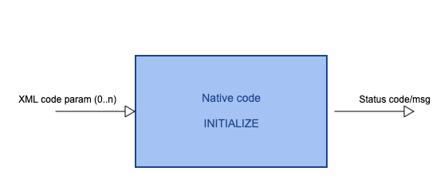

.. _native_code_api:

############################################################
Code standardisation
############################################################

Introduction
############

.. warning::
      A signature of user code must follow strict rules to
      be wrapped by iWrap - without the detailed knowledge
      of method signature iWrap cannot built an actor.

iWrap actor can call following methods of the native code:

- Basic methods:

  -  *INIT* - Initialisation method
  -  *MAIN* - Mandatory main ("step") method
  -  *FINALIZE* - Finalisation method

- Code restarting methods

  - *GET_STATE* - Method for getting internal state of the code
  - *SET_STATE* - Method for setting internal state of the code

- Auxiliary methods

  - *GET_TIMESTAMP* - Method for getting currently computed physical time

Signatures of methods may differ, depending of features of
programming language being used, however the main principia
remains the same.

Basic methods
################

*INIT* method
======================

- An optional method used for set-up of native code
- If provided - the method is called only, when an actor is initialised
- The method must be run **before** a call of *main* and *finalisation* (if provided)
- The method can be of arbitrary name (the name has to be specified in the code YAML description)
- Method arguments:

  - Code parameters:

    -  **Optional** argument
    -  Type: string
    -  Intent: IN

*MAIN* method
======================

.. image::../images/70877452/70877459.png                                                       |

-  A **mandatory** method that native code **must** provide
-  The method can be run an arbitrary numer of times (e.g. in a loop)
-  It can be of arbitrary name (the name has to be specified in the code YAML description)
-  The method must be run **after** a call of *initialisation* (if provided) and **before** a call of *finalisation* (if provided)
-  Method arguments:

   -  Input and output IDSes:

      -  **Mandatory**  arguments
      -  Type: An object of IDS class (depends on particular language)
      -  Intent: IN or OUT

   -  XML parameters:

      -  **Optional**  argument
      -  Type: string
      -  Intent: IN

*FINALIZE* method
======================
   .. image:: ../images//70877452/77370389.png

-  An optional method that is usually called to clean-up environment
-  The method can be run an arbitrary numer of times
-  The method can be of arbitrary name (the name has to be specified in the code YAML description)
-  No IN/OUT arguments

Code restarting methods
###############################
The methods of wrapped code are run ‘atomically’, so no interaction between an actor and native method is possible
and the actor cannot force the wrapped ``MAIN`` method to save a checkpoint at an arbitrary time,
while it is executed.

``GET_STATE`` and  ``SET_STATE`` methods enable restart stateful, sometimes compute demanding,
codes without losing results obtained before computations were stopped. The wrapped code may be asked periodically
about its internal state using ``GET_STATE`` method. After restart, the code state can be restored
using ``SET_STATE`` method.

An internal state of the code has to be passed as a string, however iWrap gives a full flexibility
to the code developer concerning format and content of state description.
It is a kind of a ‘black box’ returned from ``GET_STATE`` and passed to ``SET_STATE`` method during restart,
so the only requirement is that information returned by ``GET_STATE`` is understandable to ``SET_STATE``.

*GET_STATE* method
======================

- An optional method used for getting internal state of native code
- The method must be run **after** a call of ``INIT`` (if provided)
- The method can be of arbitrary name (the name has to be specified in the code YAML description)
- Method arguments:

  - Code state:

    -  **Mandatory** argument
    -  Type: string
    -  Intent: OUT

*SET_STATE* method
======================

- An optional method used for restoring internal state of native code
- The method must be run **after** a call of ``INIT`` (if provided)
- The method can be of arbitrary name (the name has to be specified in the code YAML description)
- Method arguments:

  - Code state:

    -  **Mandatory** argument
    -  Type: string
    -  Intent: IN

.. warning::
       Important!
          A native code wrapped by iWrap that will become a part of workflow should be compiled using the same
          environment in which workflow will be run!

Auxiliary methods
###############################

*GET_TIMESTAMP* method
======================

- An optional method used for getting currently computed physical time point
- The method must be run **after** a call of ``INIT`` (if provided)
- The method can be of arbitrary name (the name has to be specified in the code YAML description)
- Method arguments:

  - Timestamp:

    -  **Mandatory** argument
    -  Type: double float
    -  Intent: OUT

Error and status reporting
###############################
The wrapped code can communicate with a caller by throwing exceptions (Java)
or using two **mandatory** output arguments (C++ and Fortran):

  - Status code:

    -  **Mandatory** argument
    -  Type: Integer
    -  Intent: OUT
    -  Values:

       - negative number - *ERROR*
       - 0 - *SUCCESS*
       - positive number - *WARNING*

  - Status message

    -  **Mandatory** argument
    -  Type: string of developer defined, arbitrary content
    -  Intent: OUT

MPI
################
All native codes that use MPI should follow the rules described below:

-  Please make initialisation and finalisation conditional checking if such action was already made.

    Fortran

    .. code-block:: fortran

        !   ----  MPI initialisation ----
        call MPI_initiazed(was_mpi_initialized, ierr)
        if (.not. was_mpi_initialized)   call MPI_Init(ierr)

        !   ----  MPI Finalisation ----
        call MPI_finalized(was_mpi_finalized, ierr)
        if (.not. was_mpi_finalized)   call MPI_Finalize(ierr)

    C++

    .. code-block:: cpp

        int was_mpi_initialized, was_mpi_finalized;

        //----  MPI initialisation ----
        MPI_Initialized(&was_mpi_initialized);
        if (!was_mpi_initialized)
            MPI_Init(NULL, NULL);

        //----  MPI Finalization ----
        MPI_Finalized(&was_mpi_finalized);
        if (!was_mpi_finalized)
           MPI_Finalize();

-  Please be aware of a special role of ranked 0 process: Wrapper that run native code, launched in parallel,
   reads input data in every processes but writes it only in'rank 0' process. So native code should gather all
   results that need to be stored by 'rank 0' process. It concerns also those coming from 'rank 0' process are
   analysed by wrapper.

.. warning::
      iWrap supports only **sequential** Java code!

Code packaging
################
A native code written in C++ or Fortran should be packed within static Linux library using e.g. ar tool for that purpose.

.. code-block:: console

    ar -cr lib<name>.a <object files *.o list>
    e.g.:
    ar -cr libphysics_ii.a *.o

