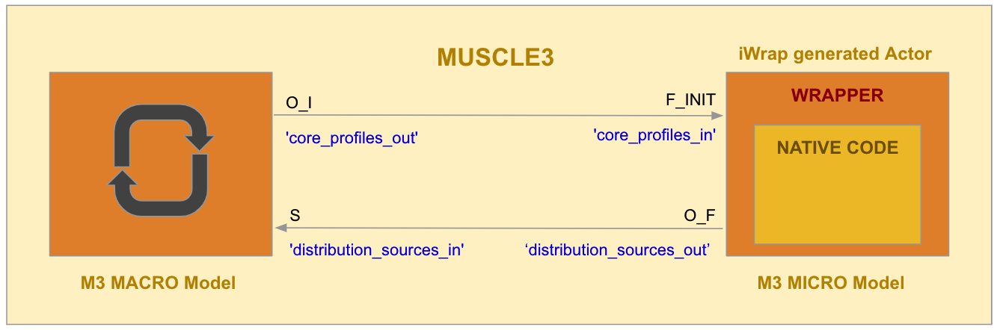
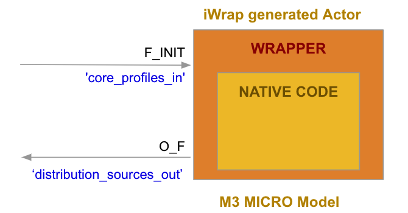

.. sectnum::

.. toctree::
   :numbered:
   :maxdepth: 10

MUSCLE3 actor generators requirements
#######################################################################################################################
Following software must be available to wrap the code into MUSCLE3 models:

- *iWrap* - MUSCLE3 actors generators are provided as iWrap plugins, thus they cannot be used without iWrap
- *MUSCLE3 libraries* - indispensable for building actors - should be available via ``pkg-config`` mechanism
- *MUSCLE3 actor generator plugins* - all paths to generator packages must be listed on the ``PYTHONPATH``

.. note::
   Usually operation system can be configured using ``modules`` toolkit, so in most cases loading ``iwrap4paf``
   is enough to configure user working environment.

   **Warning**: Module name(s) may vary depending on platform!

The code to be wrapped
#######################################################################################################################
Physics codes, to be used for generation of an actor can be of arbitrary content but must follow the standardized interface (API)
introduced with iWrap: a mandatory main function and optional ones for the initialization,
the finalization, for saving/restoring internal state and for getting the current timestamp.

.. warning::
   The INIT and FINALIZE methods of the provided code cannot have IDS arguments, to be wrapped to MUSCLE3 model.

.. note::
   To keep compatibility of the native code with other kinds of generators, the code itself should be ‘MUSCLE3 agnostic’:
   no MUSCLE3 methods should be called from within a wrapped code.

Actor generation
#######################################################################################################################

To generate MUSCLE3 actor, `muscle3-<language>` needs to be chosen out of all available actor types.
it can be done using either iwrap command line, YAML describing an actor or iWrap GUI.

.. code-block:: console

   shell> iwrap --actor-type muscle3-<language> -f code_description.yaml

.. code-block:: YAML
   :caption: Actor description
   :emphasize-lines: 3

   actor_description:
        ...
        actor_type: muscle3-<language>    # Actor type set to MUSCLE3 actor
        ...

   code_description:
        ...

.. tip::
   To help developers write MUSCLE3-compliant code, the iWrap MUSCLE3 plug-in allows you
   to generate so-called **actor's skeleton**.
   The **actor's skeleton** is a source code for a given actor without embedding actual calls to native code.
   All places where subroutines from the code could be introduced are clearly marked with comments
   in the generated source code.
   To generate this kind of the source code, simply leave out (or comment out the `programming_language` entry
   of code description

MUSCLE3 actor
#######################################################################################################################

Created actor contains a native code placed into a standalone executable `<actor_name>.exe` that acts
as a MUSCLE3 function.

A generated code intermediates between a wrapped code and MUSCLE3 library. It's main functionality includes:

- Management of inter-model communication:

  - deserialization of IDSes received from MUSCLE3 and passing them to wrapped code
  - serialization of IDSes returned by wrapped code and sending them using MUSCLE3
- Handling actor checkpointing and restarting

Physical time handling
=========================================================================================

MUSCLE3 supports sending and receiving timestamped messages, which can help support consistent physical time handling
throughout the coupled simulation. Providing timestamps is optional, however, for checkpoint support it is required.
IDSes are sent in separate messages, using dedicated channels:

- If code provides the GET_TIMESTAMP method, (single) timestamp obtained from this method will be used
  for all output IDS messages (this is the time of the model, time in individual IDS may be slightly smaller,
  but never larger).

- If GET_TIMESTAMP method is not available, while sending particular IDS:

  - if IDS/time is allocated -  IDS/time[last_index] will be used as message timestamp
    (note: heterogeneous can also have that filled as the "common" time for this IDS)
  - if IDS/time is not allocated - timestamp will be set to invalid value

iWrap MUSCLE3 actor control flow
=========================================================================================
Basic MUSCLE3 control flow could be briefly described as follows: once the MUSCLE3
and the wrapped code are initialized, at every iteration of the MUSCLE3 reuse loop,
the actor will receive data from other models, call the ‘main’ method of the wrapped model
and send data computed by mode. Computations finish with the clean up operations.

#. Initialisation:

   a. MUSCLE3 system initialisation
   #. Model initialisation - a model INIT method is called (if provided)

#. A main ‘MUSCLE3 controlled’ loop:

   a. The actor receives input IDSes from interoperating MUSCLE3 models
   #. The MAIN method of the wrapped code is called
   #. Sending output IDSes to interoperating MUSCLE3 models

#. Finalisation

   a. Model finalization:  a model finish method is called (if provided)
   #. MUSCLE3 system cleanup

.. code-block:: fortran
   :caption:  MUSCLE3 actor structure (simplified Fortran-like pseudo code)

   > > >  ENVIRONMENT INITIALIZATION < < <
   CALL init_muscle(instance)
   CALL wrapped_code_init([code_params])    ! called if init provided

   ! > > >  MUSCLE3 LOOP. < < <
   do while (LIBMUSCLE_Instance_reuse_instance(instance))

         ! > > >  RECEIVING INPUT IDSes  < < <
         CALL receive_input_idses(instance, ids1_in, ids2_in, ...)

        ! > > >  WRAPPED CODE  < < <
        CALL wrapped_code(ids1_in, ids2_in, ...,  ids1_out, ids2_out, ...[, code_params])

        ! > > >  SENDING OUTPUT IDSes  < < <
        ! if GET_TIMESTAMP method provided
        timestamp = get_timestamp_from_wrapped()
        ! else obtained from IDS time vector, while sending particular IDS

        CALL send_output_idses(instance, ids1_out, ids2_out, ..., timestamp)

   end do  ! MUSCLE3 loop

   ! > > >  FINALIZATION < < <
   CALL wrapped_code_finalize()    ! called if finalize provided
   CALL finalize_muscle(instance)

Wrapping of MPI codes
=========================================================================================

Since the actor doesn’t know how the model distributes its work over the processes,
it is the wrapped code duty to properly communicate the inputs to the other MPI processes,
run computations, collect the results, and return them in the root process.

* The MAIN function (see iWrap model basic API) is called  on all MPI processes and all processes
  received valid IDSes. In contrary, the result of the main function is ignored in all non-root processes.

* The INIT and FINALIZE functions are called on all MPI processes.

* The GET_STATE and SET_STATE functions are called on all MPI processes. However,
  only the root process will receive a non-empty input for SET_STATE. Similarly,
  the result of the GET_STATE function is ignored in all non-root processes.

Note that, even though each process in the template below calls `receive_idses`,
only the root process actually receives data. The other processes receive a dummy message,
thereby acting as a barrier without relying on a spinloop. For a detailed explanation of the MUSCLE3 API with MPI,
we refer to the `MUSCLE3 documentation <https://muscle3.readthedocs.io/en/latest/mpi.html>`_
To overcome this issue a wrapping code broadcasts every IDS from root to all non-root processes.

.. warning::
   MUSCLE3 provides MPI support only for C++ and Fortran, so the iWrap generator handles MPI only in these languages.

.. code-block:: fortran
   :caption:  Generated MUSCLE3 MPI actor structure (simplified Fortran-like pseudo code)

   > > >  ENVIRONMENT INITIALIZATION < < <
   CALL mpi_initialization(mpi_rank)
   CALL init_muscle(instance)
   CALL wrapped_code_init([code_params])    ! called if init provided

   ! > > >  MUSCLE3 LOOP. < < <
   do while (LIBMUSCLE_Instance_reuse_instance(instance))

      ! > > >  RECEIVING INPUT IDSes  < < <
      CALL receive_idses(instance, ids1_in, ids2_in, ...)

      if (mpi_rank == 0) then
       ! Broadcast all IDSes to non-root processes
      endif

      ! > > >  WRAPPED CODE  < < <
      CALL wrapped_code(ids1_in, ids2_in, ...,  ids1_out, ids2_out, ..., [, code_params])

      if (mpi_rank == 0) then
         ! > > >  SENDING OUTPUT IDSes  < < <
         ! if GET_TIMESTAMP method provided
         timestamp = get_timestamp_from_wrapped()
         ! ELSE obtained from IDS time vector, while sending particular IDS

          CALL send_ids(instance, ids1_out, ids2_out, ..., timestamp)
      endif

   end do  ! MUSCLE3 loop

   ! > > >  FINALIZATION < < <
   CALL wrapped_code_finalize()    ! called if finalize provided
   CALL finalize_muscle(instance)
   CALL mpi_finalization()

The restart feature
=========================================================================================
The wrapped code is run ‘atomically’, so no interaction between an actor and native method is possible
(the actor cannot force the model method to save a checkpoint at an arbitrary time, while it is executed).
Additionally, the wrapped methods are ‘MUSCLE3 agnostic’ -  no calls of MUSCLE3 checkpointing methods
are available within the wrapped code. Nevertheless, to support stateful, compute demanding codes,
iWrap generated actors offers the possibility of a smooth restart of the model without losing
results obtained before error/crash occurred, based on MUSCLE3 checkpointing mechanism.

To enable this feature, the wrapped code MUST provide both a method `GET_STATE` returning information
describing the code internal state, and a method `SET_STATE` restoring the state.

.. code-block:: fortran
   :caption:  Generated MUSCLE3 actor structure with restart enabled (simplified Fortran-like pseudo code)

   logical :: initial_run = .TRUE.

   > > >  ENVIRONMENT INITIALIZATION < < <
   CALL mpi_initialization(mpi_rank)
   CALL init_muscle(instance)

   ! > > >  MUSCLE3 LOOP. < < <
   do while (LIBMUSCLE_Instance_reuse_instance(instance))

      !  - - - WRAPPED CODE INITIALIZATION - - -  # # # #
      if ( LIBMUSCLE_Instance_resuming(instance)) then
         ! > > >  RESTART : the code is restored from the saved snapshot  < < <
         if (process_rank == MPI_ROOT_RANK) then
             CALL restore_wrapped_code_state(instance)
         endif
      else  ! m3_instance is not resuming
         ! > > >  INITIALIZATION by calling INIT method  of the code < < <
          if (initial_run) then
             CALL wrapped_code_init([code_params])    ! called if init provided
          endif
      endif ! LIBMUSCLE_Instance_resuming
      initial_run = .FALSE.

      if( LIBMUSCLE_Instance_should_init(instance)) then
         ! > > >  RECEIVING INPUT IDSes  < < <
         CALL receive_idses(instance, ids1_in, ids2_in, ...)
      endif ! LIBMUSCLE_Instance_should_init

      ! > > >  WRAPPED CODE  < < <
      CALL wrapped_code(ids1_in, ids2_in, ...,  ids1_out, ids2_out, ..., [, code_params])

      if (mpi_rank == MPI_ROOT_RANK) then
         ! > > >  SENDING OUTPUT IDSes  < < <
         ! if GET_TIMESTAMP method provided
         timestamp = get_timestamp_from_wrapped()
         ! ELSE obtained from IDS time vector, while sending particular IDS

          CALL send_ids(instance, ids1_out, ids2_out, ..., timestamp)
      endif

      ! > > >  SAVE SNAPSHOT < < <
      if (LIBMUSCLE_Instance_should_save_final_snapshot(instance)) then
         if (process_rank == MPI_ROOT_RANK ) then
             CALL save_wrapped_code_state(instance)
         endif
      endif

   end do ! < < < MUSCLE3 LOOP < < <

   ! > > >  FINALIZATION < < <
   CALL wrapped_code_finalize()    ! called if finalize provided
   CALL finalize_muscle(instance)
   CALL mpi_finalization()

MUSCLE3 models coupling and running
#######################################################################################################################
Models, either wrapped by iWrap or prepared by user in any other way, have to be coupled manually
by workflow/scenario designer following MUSCLE3 standard guidelines and rules.

MUSCLE3 models coupling
=========================================================================================
MUSCLE3 uses the Multiscale Modelling and Simulation Language (MMSL) to describe
the structure of a multiscale model. MMSL can be expressed as a YAML file (yMMSL).
The MMSL lets one describe which components (submodels, scale bridges, data converters, UQ components, etc.)
a multiscale model consist of, how many instances of each we need, and how they are wired together.

Following asumptions and limitations should be taken into consideration while designing a MUSCLE3 scenario:

   - Communication is managed (only) by a wrapper
   - Actor communicates with other model(s) by sending/receiving IDSes
   - Every message contains only one IDS
   - IDSes are received via port of `F_INIT` type
   - IDSes are sent via port of `O_F` type
   - Every port handles only one in/out argument (IDS)
   - Port number and names correspond to argument of wrapped code
   - MPI: data are sent and received only by the root MPI process

Changing code parameters of an actor
=========================================================================================
Setting ``<component_name>.parameters_file`` property in yMMLS file (see example below)
forces an actor to read parameters from the pointed file and not from the default one.

.. warning::
   - Only absolute path to code parameters file can be specified
   - No system variables can be a part of specified path
   - The code parameters read from the file must conform a code parameter schema provided by a code developer at the actor generation stage.

.. code-block:: YAML
   :caption: An example of a MUSCLE3 yMMLS workflow description
   :emphasize-lines: 7,8

   model:
     name: helloworld
     components:
       macro: macro
       micro: micro
   ...
   settings:
     micro.parameters_file: /path/to/parameters.xml

Provenance info
=========================================================================================

YAML description
---------------------
In order to provide additional information about actor configuration, actor/code description YAML file is being copied into actor's directory during generation process.

Code parameters
---------------------
Setting ``copy_xml_parameters`` property in yMMLS file (see example below)
forces an actor to save code parameters XML file in workdir during execution. If not set, parameters won't be saved.

.. code-block:: YAML
   :caption: An example of a MUSCLE3 yMMLS workflow description
   :emphasize-lines: 7,8

   model:
     name: helloworld
     components:
      macro: macro
      micro: micro
   ...
   settings:
     copy_xml_parameters: true

Running MUSCLE3 scenario
=========================================================================================
An yMMSL description of the computing scenario needs to be run using `muscle_manager`
- the central run-time component of MUSCLE3. It is started together with the component
intances, and provides a central coordination point that the instances use to find each other.
The manager also collects log messages from the individual instances to aid in debugging,
and some profiling information to aid in scheduling and performance optimisation.

.. note:: Further reading:

   -    `yMMSL overview <https://ymmsl-python.readthedocs.io/en/latest/overview.html>`_
   -    `MUSCLE3 tutorial <https://muscle3.readthedocs.io/en/latest/tutorial.html>`_

Example
#######################################################################################################################
This example shows how to prepare and run an MUSCLE3 computing scenario, consisting of two codes
(aka. MUSCLE3 models), communicating with each other by sending/receiving IDSes:

- prepared manually *MUSCLE3 macro model*
- a native code wrapped automatically by iWrap into *MUSCLE3 function*

Wrapping code into MUSCLE3 function
=========================================================================================

A code to be wrapped is a very simple Fortran subroutine, obtaining `core_profiles` IDS as input
and returning `distribution_sources` IDS. To be compatible with 'iWrap standardized API' argument list
contains also `status_code` and `status_message`.

.. literalinclude:: /resources/example/wrapped_code.f90
   :language: fortran
   :caption: wrapped_code.f90

The wrapped code has to be compiled and packed into a static library.

.. code-block:: console
   :caption: Building wrapped code

    gfortran -c -o wrapped_code.o wrapped_code.f90 `pkg-config --cflags imas-gfortran`
    @ar -rcs libwrapped_code.a wrapped_code.o

Once a static library is built, the code description has to to be prepared,
to provide iWrap with all information required to generate an actor.

.. literalinclude:: /resources/example/code_description.yaml
   :language: YAML
   :caption: code_description.yaml

To generate an actor, one has to call `iwrap` command providing an actor type (`muscle3`),
an arbitrary actor name and YAML file containing the code description.

.. code-block:: console
   :caption: Actor generation

   iwrap --actor-type muscle3 --actor-name m3_actor -f ./code_description.yaml

If generation was successful, an executable `m3_actor.exe` containing user provided subroutine
wrapped into MUSCLE3 function, is created in `<IWRAP_ACTORS_DIR>/m3_actor/bin/` directory.

.. note::
   Please notice, that ports of generated actor have exactly the same names
   as they have been defined in  code description YAML

.. literalinclude:: /resources/example/standalone.f90
   :language: fortran
   :caption: Autogenerated code

Macro model
=========================================================================================
A `macro model` code has to be prepared manually. This code "triggers" a generated actor
sending to it `core_profiles` IDS and receiving back computed `distribution_sources` IDS

.. literalinclude:: /resources/example/macro.f90
   :language: fortran
   :caption: macro.f90

.. code-block:: console
   :caption: Building macro model

   gfortran -o macro.exe macro.f90 `pkg-config --cflags --libs imas-gfortran ymmsl libmuscle_fortran`

Scenario description
=========================================================================================

.. literalinclude:: /resources/example/example.ymmsl
   :language: YAML
   :caption: example.ymmsl

Launching an example
=========================================================================================

.. code-block:: console
   :caption: Running an example

   muscle_manager --start-all example.ymmsl

