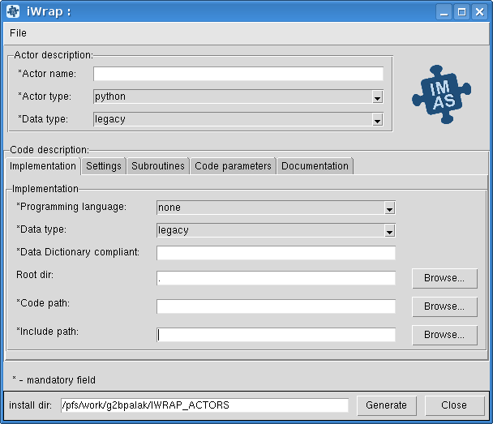

---
jupytext:
  text_representation:
    extension: .md
    format_name: myst
    format_version: 0.13
    jupytext_version: 1.16.0
kernelspec:
  display_name: Python 3 (ipykernel)
  language: python
  name: python3
---

# Welcome to the iWrap Docs!


## Motivation

`iWrap` is a tool designed to facilitate the composition of complex simulations in IMAS involving multiple physics codes (actors), which may:
- be implemented by groups of developers
- and written in different programming languages.
  
The challenge lies in **making these codes work together**. Part of this challenge is addressed by using the common data structures defined by 
the IMAS Data Dictionary, the rest (isolation, standard API and cross language barriers) is addressed by iWrap.

```{admonition} Note!
:class: note

iWrap acts as a **connecting layer**, helping to *coordinate the execution of each individual code and managing the exchange of data between various components*.   
This role is crucial in environments where different codes need to interact seamlessly.
```

In many cases, scientific codes and algorithms that perform computationally intensive calculations are written in languages like `C++` or `Fortran`. On the other hand, **workflow orchestrators** often use dynamic coding languages such as `Java` or `Python`. This disparity in languages necessitates the need for a 'wrapper' that bridges the gap between the  code language and the orchestrator's language.

```{admonition} And this is where iWrap goes in!
:class: hint

`iWrap` serves as a solution to this problem by generating these wrappers.   
By doing so, it relieves users from the need to manually developing the wrappers, which would otherwise require much effort and an in-depth understanding of all the components involved in the process.     

***With iWrap, users can integrate their  code into the workflow without worrying about language compatibility, thereby enabling better collaboration between different codes.***

```


## About iWrap

`iWrap` is a tool designed in `Python`, and is used fo creating what we call **actors** for the Integrated Modeling and Analysis Suite (IMAS).   
These actors serve as connectors between your physics models (written in languages like Fortran or C++) and more complex computing (workflows) built in languages like Python.

```{admonition} Actor model in general Information Technology
:class: dropdown

The Actor model is a conceptual framework for designing and implementing concurrent and distributed systems.   
It defines a computational model in which software components called **actors** interact with each other by exchanging data.  

Here are some key points about the Actor model:

1. **Actors**: Actors are fundamental units of computation in the Actor model. Each actor is an independent entity with its own state and behavior. Actors can send data to other actors, and change their internal state in response to data.

2. **Data Exchange**: Communication between actors is achieved solely through data exchange. An actor can send data to another actor, and the receiving actor processes the data when it chooses to. If data exchange is implemented by asynchronous message passing it enables concurrency and isolation.

3. **Isolation**: Actors are isolated from each other, meaning the internal state of one actor cannot be directly accessed or modified by another actor. This isolation helps prevent data races and simplifies concurrency control.

4. **Concurrency**: The Actor model provides a natural way to express concurrent behavior. Multiple actors can run concurrently, processing messages independently. This allows for efficient use of multi-core processors and distributed systems.

5. **Fault Tolerance**: The Actor model is well-suited for building fault-tolerant systems. If an actor encounters an error or fails, it can be restarted, and its state can be restored from a known point, ensuring system resilience.


Source: https://en.wikipedia.org/wiki/Actor_model
```

iWrap is built around a plug-in based modular design, making it very flexible and versatile.   
It enables you to generate various types of actors and switch between different data representation and access methods. 

```{admonition} MUSCLE3 Integration
:class: important

iWrap is engineered with modularity in mind, enabling it to generate a variety of actor types to suit your specific needs.  
Currently, it supports the creation of `Python` actors for straightforward Python integrations and `Muscle3` actors for more complex, high-performance computing scenarios.

```

```{admonition} But what this mysterious actor does under the hood?
:class: tip

When you use iWrap, it generates a Python class which acts as the **actor**. This actor does several essential tasks:

1. Input/output operations using IDS
2. Calls your  code: physics model is properly integrated within the computing scenario and the wrapper ensures they are accessible from the Python script.
3. Supports debugging mode: If you encounter issues, you can run iWrap in "debug" mode to aid in troubleshooting.
4. Incorporates error-handling mechanisms.
5. Runs MPI code: iWrap supports running your code in parallel using MPI (Message Passing Interface) for efficient computations.
```


## iWrap Interfaces

For your convenience, iWrap provides two user interfaces:

### User-Friendly Graphical Interface
Ideal for beginners and non-experienced users, this graphical interface lets you define an actor intuitively, making the process straightforward.



### Command-Line Interface
More advanced users can take advantage of the command-line interface, which allows automation of the actor generation process using scripts.

```{code-cell}
:tags: [output-scroll]

!iwrap -h
```


