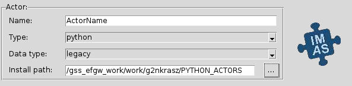
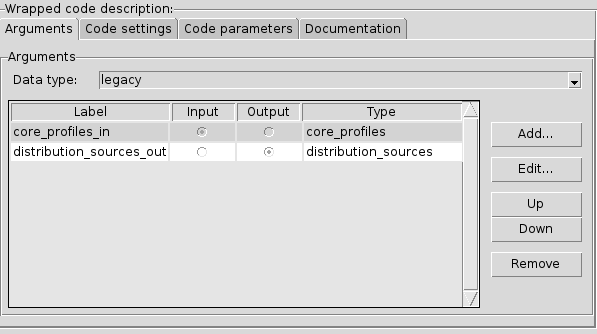
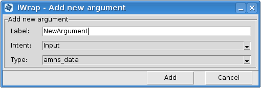
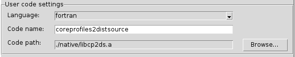
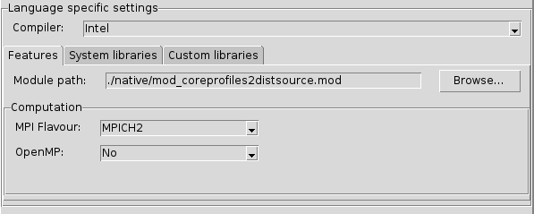
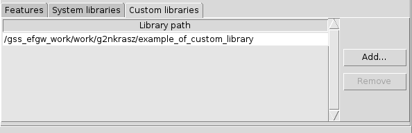

:orphan:
==================================================
Scientific Worfklows : iWrap - graphical interface
==================================================

.. container::
   :name: page

   .. container:: aui-page-panel
      :name: main

      .. container::
         :name: main-header

         .. container::
            :name: breadcrumb-section

            #. `Scientific Worfklows <index.html>`__
            #. `Wrapping user codes into actors -
               iWrap <Wrapping-user-codes-into-actors---iWrap_70877391.html>`__

         .. rubric:: Scientific Worfklows : iWrap - graphical interface
            :name: title-heading
            :class: pagetitle

      .. container:: view
         :name: content

         .. container:: page-metadata

            Created by Bartosz Palak, last modified by Natalia
            Kraszewska on 09 wrz 2021

         .. container:: wiki-content group
            :name: main-content

            .. container:: toc-macro rbtoc1632746267207

               -  `1. iWrap
                  purpose <#iWrapgraphicalinterface-iWrappurpose>`__
               -  `2. iWrap main
                  window <#iWrapgraphicalinterface-iWrapmainwindow>`__
               -  `3. Actor
                  description <#iWrapgraphicalinterface-Actordescription>`__
               -  `4. Code
                  description <#iWrapgraphicalinterface-Codedescription>`__

                  -  `4.1.
                     Arguments <#iWrapgraphicalinterface-Arguments>`__

                     -  `4.1.1.  Add
                        argument <#iWrapgraphicalinterface-Addargument>`__
                     -  `4.1.2. Edit
                        argument <#iWrapgraphicalinterface-Editargument>`__

                  -  `4.2. Code
                     settings <#iWrapgraphicalinterface-Codesettings>`__

                     -  `4.2.1. User code
                        settings <#iWrapgraphicalinterface-Usercodesettings>`__
                     -  `4.2.2. Language specific
                        settings <#iWrapgraphicalinterface-Languagespecificsettings>`__

                        -  `4.2.2.1.
                           Features <#iWrapgraphicalinterface-Features>`__
                        -  `4.2.2.2. System
                           libraries <#iWrapgraphicalinterface-Systemlibraries>`__

                           -  `4.2.2.2.1. Add system
                              libraries <#iWrapgraphicalinterface-Addsystemlibraries>`__

                        -  `4.2.2.3. Custom
                           libraries <#iWrapgraphicalinterface-Customlibraries>`__

                  -  `4.3. Code
                     parameters <#iWrapgraphicalinterface-Codeparameters>`__
                  -  `4.4.
                     Documentation <#iWrapgraphicalinterface-Documentation>`__

            .. container::
            .. note::

               .. container:: confluence-information-macro-body

                  **This tutorial explains:**

                  -  iWrap graphic user interface
                  -  How to set up actor description
                  -  How to set up code description 

            .. rubric:: 1.iWrap purpose
               :name: iWrapgraphicalinterface-iWrappurpose

            -  iWrap generates a Fortran/CPP wrapper, which
               intermediates between Kepler actor and user code in terms
               of:

               -  reading/writing of in/out physical data (IDS)
               -  passing other arguments to/from the actor

            -  iWrap creates a Python script (aka an actor) that:

               -  calls a user code
               -  provides error handling
               -  calls debugger (if run in "debug" mode)

            .. rubric:: 2.iWrap main window
               :name: iWrapgraphicalinterface-iWrapmainwindow

            |image1|

            .. rubric:: 3.Actor description
               :name: iWrapgraphicalinterface-Actordescription

            |image2|

            This group of graphical controls allows setting the
            description of the actor.

            -  Name - a user-defined name of the actor
            -  Type - a user-defined type of the actor
            -  Data type -  an actor data type
            -  Install path - path where actor will be installed

            .. rubric:: 4.Code description
               :name: iWrapgraphicalinterface-Codedescription

            .. rubric:: 4.1.Arguments
               :name: iWrapgraphicalinterface-Arguments

            |image3|

            -  **Data type** - an arguments data type

            In the table, there are columns like:

            -  **Label** - user defined name of an argument
            -  **Input/Output** - defines argument as \ *an
               input/output*
            -  **Type** - defines an IDS based type of argument (e.g.
               equilibrium, topinfo, etc.) 

            | 

            On the right side of the table, there is a section with
            buttons. Add button allows to add a new argument, edit to
            edit argument and up/down buttons are changing the position
            of selected argument in the table. The remove button removes
            selected argument.

            .. container::
            .. note::

               .. container:: confluence-information-macro-body

                  To change **Edit**, **Up**/**Down,** and **Remove**
                  buttons state to active at least one argument has to
                  be added to the table. 

            .. rubric:: 4.1.1. Add argument
               :name: iWrapgraphicalinterface-Addargument

            |image4|

            To add new arguments click **Add...** button in the
            *Arguments* section. A new window named *iWrap - Add new
            argument* will appear. Filling label (argument can be also
            added with empty label) and selecting intent and type allow
            adding new argument by clicking **Add** button. Click
            **Cancel** to exit this window. 

            .. rubric:: 4.1.2.Edit argument
               :name: iWrapgraphicalinterface-Editargument

            |image5|

            There is also possible to edit arguments. When **Edit...**
            button in the *Arguments* section is clicked, a new window
            *iWrap - Edit argument* will appear. Change settings and
            approve it by clicking **Close** button. To exit the window
            click **Cancel**.

            .. rubric:: 4.2.Code settings
               :name: iWrapgraphicalinterface-Codesettings

            |image6|

            .. rubric:: 4.2.1.User code settings
               :name: iWrapgraphicalinterface-Usercodesettings

            |image7|

            -  **Language** - a user code language
            -  **Code** **name** - a user code name
            -  **Code** **path** - a user code path 

            .. rubric:: 4.2.2.Language specific settings
               :name: iWrapgraphicalinterface-Languagespecificsettings

            |image8|

            -  **Compiler** - a compiler used to built library,
               available compilers are:

               -  Intel Fortran (ifort)
               -  GNU Compiler Collection (fortran)
               -  Intel

            .. rubric:: 4.2.2.1.Features
               :name: iWrapgraphicalinterface-Features

            |image9|

            -  **Module path** - path to the module
            -  **Computation**:

               -  **MPI Flavour** - MPI library, available compilers
                  are:

                  -  MPICH2
                  -  OpenMPI
                  -  None - if actor isn't MPI based 

               -  **OpenMP** - defines if usage of OpenMP directives is
                  turned No/Yes

            .. rubric:: 4.2.2.2.System libraries
               :name: iWrapgraphicalinterface-Systemlibraries

            *System libraries*\ are system libraries handled by the
            pkg-config mechanism and required for building the user
            code.

            |image10|

            In the table there is information about:

            -  Name - a library name
            -  Info - information about library
            -  Description - a library description 

            System library can be added and removed using buttons placed
            on the right side of the table.

            .. container::
            .. note::

               .. container:: confluence-information-macro-body

                  To change **Remove** button state to active at least
                  one system library has to be added and selected.

            .. rubric:: 4.2.2.2.1.Add system libraries
               :name: iWrapgraphicalinterface-Addsystemlibraries

            To add new arguments click **Add...** button in the *System
            libraries* section. A new window named *Add system library*
            will appear. *Search* field allows for easy filtering the
            list of libraries. To add a system library select your
            choice and click **Ok** button. To close window click
            **Cancel**.

            |image11|

            .. rubric:: 4.2.2.3.Custom libraries
               :name: iWrapgraphicalinterface-Customlibraries

            *Custom libraries* are non-standard static libraries
            required for building the user code.

            |image12|

            Available operations on libraries list:

            -  **Add...** - Adds a new library to the list
            -  **Remove** - Removes a new library from the list

            | 

            .. container::
            .. note::

               .. container:: confluence-information-macro-body

                  To change **Remove** button state to active at least
                  one library path has to be added and selected.

            .. rubric:: 4.3.Code parameters
               :name: iWrapgraphicalinterface-Codeparameters

            *Code parameters*\ are all parameters that are specific to
            the code (like switches, scaling parameters, and parameters
            for built-in analytical models) as well as parameters to
            explicitly overrule fields in the IMAS data structures.

            |image13|

            -  **Code parameters file** - XML file contains code
               parameters 
            -  **Schema file** - XSD file contains schema

            .. rubric:: 4.4.Documentation
               :name: iWrapgraphicalinterface-Documentation

            The\ *Documentation*\ tab specifies a user-defined actor
            description.

            |image14|

            | 

         .. container:: pageSection group

            .. container:: pageSectionHeader

               .. rubric:: Attachments:
                  :name: attachments
                  :class: pageSectionTitle

            .. container:: greybox

               |image15|
               `image2021-9-7_13-20-11.png <attachments/70877876/70878309.png>`__
               (image/png)
               |image16|
               `image2021-9-7_13-20-22.png <attachments/70877876/70878310.png>`__
               (image/png)
               |image17|
               `image2021-9-7_13-21-1.png <attachments/70877876/70878311.png>`__
               (image/png)
               |image18|
               `image2021-9-7_13-21-56.png <attachments/70877876/70878312.png>`__
               (image/png)
               |image19|
               `image2021-9-7_13-23-57.png <attachments/70877876/70878318.png>`__
               (image/png)
               |image20|
               `image2021-9-7_13-24-40.png <attachments/70877876/70878322.png>`__
               (image/png)
               |image21|
               `image2021-9-7_13-26-5.png <attachments/70877876/70878330.png>`__
               (image/png)
               |image22|
               `image2021-9-7_13-26-38.png <attachments/70877876/70878331.png>`__
               (image/png)
               |image23|
               `image2021-9-7_13-27-20.png <attachments/70877876/70878332.png>`__
               (image/png)
               |image24|
               `image2021-9-7_13-28-13.png <attachments/70877876/70878333.png>`__
               (image/png)
               |image25|
               `image2021-9-7_13-28-45.png <attachments/70877876/70878335.png>`__
               (image/png)
               |image26|
               `image2021-9-7_13-30-4.png <attachments/70877876/70878337.png>`__
               (image/png)
               |image27|
               `image2021-9-7_13-32-1.png <attachments/70877876/70878338.png>`__
               (image/png)
               |image28|
               `image2021-9-7_13-32-24.png <attachments/70877876/70878340.png>`__
               (image/png)
               |image29|
               `image2021-9-7_13-33-1.png <attachments/70877876/70878341.png>`__
               (image/png)
               |image30|
               `image2021-9-7_13-33-12.png <attachments/70877876/70878342.png>`__
               (image/png)
               |image31|
               `image2021-9-7_13-34-5.png <attachments/70877876/70878343.png>`__
               (image/png)
               |image32|
               `image2021-9-7_13-34-29.png <attachments/70877876/70878344.png>`__
               (image/png)
               |image33|
               `image2021-9-7_13-35-19.png <attachments/70877876/70878345.png>`__
               (image/png)
               |image34|
               `image2021-9-7_13-37-43.png <attachments/70877876/70878346.png>`__
               (image/png)
               |image35|
               `image2021-9-7_13-38-6.png <attachments/70877876/70878347.png>`__
               (image/png)
               |image36|
               `image2021-9-7_13-38-34.png <attachments/70877876/70878348.png>`__
               (image/png)
               |image37|
               `image2021-9-7_13-39-26.png <attachments/70877876/70878349.png>`__
               (image/png)
               |image38|
               `image2021-9-7_13-39-54.png <attachments/70877876/70878350.png>`__
               (image/png)
               |image39|
               `image2021-9-9_12-14-39.png <attachments/70877876/70879036.png>`__
               (image/png)
               |image40|
               `image2021-9-9_12-15-39.png <attachments/70877876/70879037.png>`__
               (image/png)
               |image41|
               `image2021-9-9_12-16-46.png <attachments/70877876/70879038.png>`__
               (image/png)
               |image42|
               `image2021-9-9_12-17-9.png <attachments/70877876/70879040.png>`__
               (image/png)
               |image43|
               `image2021-9-9_12-20-58.png <attachments/70877876/70879041.png>`__
               (image/png)
               |image44|
               `image2021-9-9_12-21-36.png <attachments/70877876/70879042.png>`__
               (image/png)
               |image45|
               `image2021-9-9_12-21-59.png <attachments/70877876/70879043.png>`__
               (image/png)
               |image46|
               `image2021-9-9_12-22-34.png <attachments/70877876/70879044.png>`__
               (image/png)
               |image47|
               `image2021-9-9_12-23-37.png <attachments/70877876/70879045.png>`__
               (image/png)
               |image48|
               `image2021-9-9_12-28-27.png <attachments/70877876/70879046.png>`__
               (image/png)
               |image49|
               `image2021-9-9_12-28-56.png <attachments/70877876/70879047.png>`__
               (image/png)
               |image50|
               `image2021-9-9_12-29-23.png <attachments/70877876/70879048.png>`__
               (image/png)
               |image51|
               `image2021-9-9_12-30-13.png <attachments/70877876/70879049.png>`__
               (image/png)
               |image52|
               `image2021-9-9_12-36-34.png <attachments/70877876/70879050.png>`__
               (image/png)
               |image53|
               `image2021-9-9_12-37-6.png <attachments/70877876/70879051.png>`__
               (image/png)
               |image54|
               `image2021-9-9_12-40-24.png <attachments/70877876/70879052.png>`__
               (image/png)
               |image55|
               `image2021-9-9_12-41-7.png <attachments/70877876/70879053.png>`__
               (image/png)
               |image56|
               `image2021-9-9_12-47-34.png <attachments/70877876/70879057.png>`__
               (image/png)
               |image57|
               `image2021-9-9_12-48-18.png <attachments/70877876/70879058.png>`__
               (image/png)
               |image58|
               `image2021-9-9_12-49-32.png <attachments/70877876/70879061.png>`__
               (image/png)
               |image59|
               `image2021-9-9_13-5-17.png <attachments/70877876/70879070.png>`__
               (image/png)
               |image60|
               `image2021-9-9_14-13-36.png <attachments/70877876/70879104.png>`__
               (image/png)
               |image61|
               `image2021-9-9_14-14-5.png <attachments/70877876/70879107.png>`__
               (image/png)
               |image62|
               `image2021-9-9_14-14-22.png <attachments/70877876/70879109.png>`__
               (image/png)

   .. container::
      :name: footer

      .. container:: section footer-body

         Document generated by Confluence on 27 wrz 2021 14:37

         .. container::
            :name: footer-logo

            `Atlassian <http://www.atlassian.com/>`__

.. |image1| image:: attachments/70877876/70879104.png
   :class: confluence-embedded-image
   :width: 450px

.. |image5| image:: attachments/70877876/70879057.png
   :class: confluence-embedded-image
   :width: 450px
.. |image6| image:: attachments/70877876/70879045.png
   :class: confluence-embedded-image
   :width: 450px

.. |image9| image:: attachments/70877876/70879070.png
   :class: confluence-embedded-image
   :width: 450px
.. |image10| image:: attachments/70877876/70879049.png
   :class: confluence-embedded-image
   :width: 450px
.. |image11| image:: attachments/70877876/70878345.png
   :class: confluence-embedded-image
   :width: 500px

.. |image13| image:: attachments/70877876/70879052.png
   :class: confluence-embedded-image
   :width: 450px
.. |image14| image:: attachments/70877876/70879053.png
   :class: confluence-embedded-image
   :width: 450px
.. |image15| image:: images/icons/bullet_blue.gif
   :width: 8px
   :height: 8px
.. |image16| image:: images/icons/bullet_blue.gif
   :width: 8px
   :height: 8px
.. |image17| image:: images/icons/bullet_blue.gif
   :width: 8px
   :height: 8px
.. |image18| image:: images/icons/bullet_blue.gif
   :width: 8px
   :height: 8px
.. |image19| image:: images/icons/bullet_blue.gif
   :width: 8px
   :height: 8px
.. |image20| image:: images/icons/bullet_blue.gif
   :width: 8px
   :height: 8px
.. |image21| image:: images/icons/bullet_blue.gif
   :width: 8px
   :height: 8px
.. |image22| image:: images/icons/bullet_blue.gif
   :width: 8px
   :height: 8px
.. |image23| image:: images/icons/bullet_blue.gif
   :width: 8px
   :height: 8px
.. |image24| image:: images/icons/bullet_blue.gif
   :width: 8px
   :height: 8px
.. |image25| image:: images/icons/bullet_blue.gif
   :width: 8px
   :height: 8px
.. |image26| image:: images/icons/bullet_blue.gif
   :width: 8px
   :height: 8px
.. |image27| image:: images/icons/bullet_blue.gif
   :width: 8px
   :height: 8px
.. |image28| image:: images/icons/bullet_blue.gif
   :width: 8px
   :height: 8px
.. |image29| image:: images/icons/bullet_blue.gif
   :width: 8px
   :height: 8px
.. |image30| image:: images/icons/bullet_blue.gif
   :width: 8px
   :height: 8px
.. |image31| image:: images/icons/bullet_blue.gif
   :width: 8px
   :height: 8px
.. |image32| image:: images/icons/bullet_blue.gif
   :width: 8px
   :height: 8px
.. |image33| image:: images/icons/bullet_blue.gif
   :width: 8px
   :height: 8px
.. |image34| image:: images/icons/bullet_blue.gif
   :width: 8px
   :height: 8px
.. |image35| image:: images/icons/bullet_blue.gif
   :width: 8px
   :height: 8px
.. |image36| image:: images/icons/bullet_blue.gif
   :width: 8px
   :height: 8px
.. |image37| image:: images/icons/bullet_blue.gif
   :width: 8px
   :height: 8px
.. |image38| image:: images/icons/bullet_blue.gif
   :width: 8px
   :height: 8px
.. |image39| image:: images/icons/bullet_blue.gif
   :width: 8px
   :height: 8px
.. |image40| image:: images/icons/bullet_blue.gif
   :width: 8px
   :height: 8px
.. |image41| image:: images/icons/bullet_blue.gif
   :width: 8px
   :height: 8px
.. |image42| image:: images/icons/bullet_blue.gif
   :width: 8px
   :height: 8px
.. |image43| image:: images/icons/bullet_blue.gif
   :width: 8px
   :height: 8px
.. |image44| image:: images/icons/bullet_blue.gif
   :width: 8px
   :height: 8px
.. |image45| image:: images/icons/bullet_blue.gif
   :width: 8px
   :height: 8px
.. |image46| image:: images/icons/bullet_blue.gif
   :width: 8px
   :height: 8px
.. |image47| image:: images/icons/bullet_blue.gif
   :width: 8px
   :height: 8px
.. |image48| image:: images/icons/bullet_blue.gif
   :width: 8px
   :height: 8px
.. |image49| image:: images/icons/bullet_blue.gif
   :width: 8px
   :height: 8px
.. |image50| image:: images/icons/bullet_blue.gif
   :width: 8px
   :height: 8px
.. |image51| image:: images/icons/bullet_blue.gif
   :width: 8px
   :height: 8px
.. |image52| image:: images/icons/bullet_blue.gif
   :width: 8px
   :height: 8px
.. |image53| image:: images/icons/bullet_blue.gif
   :width: 8px
   :height: 8px
.. |image54| image:: images/icons/bullet_blue.gif
   :width: 8px
   :height: 8px
.. |image55| image:: images/icons/bullet_blue.gif
   :width: 8px
   :height: 8px
.. |image56| image:: images/icons/bullet_blue.gif
   :width: 8px
   :height: 8px
.. |image57| image:: images/icons/bullet_blue.gif
   :width: 8px
   :height: 8px
.. |image58| image:: images/icons/bullet_blue.gif
   :width: 8px
   :height: 8px
.. |image59| image:: images/icons/bullet_blue.gif
   :width: 8px
   :height: 8px
.. |image60| image:: images/icons/bullet_blue.gif
   :width: 8px
   :height: 8px
.. |image61| image:: images/icons/bullet_blue.gif
   :width: 8px
   :height: 8px
.. |image62| image:: images/icons/bullet_blue.gif
   :width: 8px
   :height: 8px
