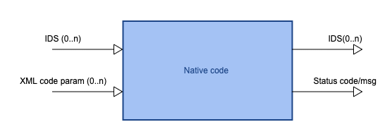

:orphan:
==============================================
Scientific Worfklows : iWrap - native code API
==============================================

.. container::
   :name: page

   .. container:: aui-page-panel
      :name: main

      .. container::
         :name: main-header

         .. container::
            :name: breadcrumb-section

            #. `Scientific Worfklows <index.html>`__
            #. `Wrapping user codes into actors -
               iWrap <Wrapping-user-codes-into-actors---iWrap_70877391.html>`__

         .. rubric:: Scientific Worfklows : iWrap - native code API
            :name: title-heading
            :class: pagetitle

      .. container:: view
         :name: content

         .. container:: page-metadata

            Created by Bartosz Palak, last modified on 10 wrz 2021

         .. container:: wiki-content group
            :name: main-content

            .. container:: toc-macro rbtoc1632746267058

               -  `1. Introduction <#iWrapnativecodeAPI-Introduction>`__
               -  `2. Fortran <#iWrapnativecodeAPI-Fortran>`__

                  -  `2.1. Native code
                     signature <#iWrapnativecodeAPI-Nativecodesignature>`__
                  -  `2.2. Module <#iWrapnativecodeAPI-Module>`__
                  -  `2.3.
                     Subroutine <#iWrapnativecodeAPI-Subroutine>`__
                  -  `2.4. Arguments <#iWrapnativecodeAPI-Arguments>`__
                  -  `2.5. Example <#iWrapnativecodeAPI-Example>`__

               -  `3.  C++ <#iWrapnativecodeAPI-C++>`__

                  -  `3.1. Native code
                     signature <#iWrapnativecodeAPI-Nativecodesignature.1>`__
                  -  `3.2. Header <#iWrapnativecodeAPI-Header>`__
                  -  `3.3. Method <#iWrapnativecodeAPI-Method>`__
                  -  `3.4.
                     Arguments <#iWrapnativecodeAPI-Arguments.1>`__
                  -  `3.5. Example <#iWrapnativecodeAPI-Example.1>`__

               -  `4. MPI <#iWrapnativecodeAPI-MPI>`__
               -  `5. Code
                  packaging <#iWrapnativecodeAPI-Codepackaging>`__

            .. rubric:: 1.Introduction
               :name: iWrapnativecodeAPI-Introduction

            A signature of user code must follow strict rules to allow
            interaction between it and wrapping actor. Without the
            detailed knowledge of method signature iWrap cannot built an
            actor.

            -  Only IDS data are accepted as dynamic data input/output 
            -  Static data provided as additional codeparam input ,
            -  Optional error code/mesg output (not mandatory),
            -  A constraint: at least one IDS is either produced or
               consumed

            | 

            +-----------------------------------------------------------------------+
            | +----------+                                                          |
            | | |image1| |                                                          |
            | +----------+                                                          |
            +-----------------------------------------------------------------------+

            | 

            -  Input and output IDSes:

               -  **Optional**\  arguments
               -  Intent: IN or OUT

            -  XML parameters:

               -  **Optional**\  argument
               -  Intent: IN

            -  Status code:

               -  **Mandatory**\  argument
               -  Intent: OUT

            -  Status message

               -  **Mandatory**\  argument
               -  Intent: OUT

            The current version of iWrap allows to wrap native code
            implemented in Fortran or C++

            | 

            | 

            .. container::
            .. warning::

               Important!

               .. container:: confluence-information-macro-body

                  A native code that will be wrapped by iWrap and that
                  will become a part of workflow should be compiled
                  using the same environment in which workflow will be
                  run!

            | 

            .. rubric:: 2.Fortran
               :name: iWrapnativecodeAPI-Fortran

            .. rubric:: 2.1.Native code signature
               :name: iWrapnativecodeAPI-Nativecodesignature

            | 

            .. container:: code panel pdl

               .. container:: codeContent panelContent pdl

                  .. code:: 

                     module <module name>
                       
                     subroutine <subroutine name> ([ids1, ids2, ..., idsN,] [xml_parameters], status_code, status_message)
                       use ids_schemas
                       ! IN/OUT IDSes
                       type(ids_<ids_name>), intent([IN|OUT]):: ids1
                       type(ids_<ids_name>), intent([IN|OUT]):: ids2
                        . . .
                       type(ids_<ids_name>), intent([IN|OUT]):: idsN 
                      
                      
                       ! XML code parameters
                       type(ids_parameters_input) :: xml_parameters
                      
                       ! status info
                       integer, intent(OUT) :: status_code
                       character(len=:), pointer, intent(OUT) :: status_message
                      
                     end subroutine <subroutine name>
                     end module <module name>

            | 

            .. rubric:: 2.2.Module
               :name: iWrapnativecodeAPI-Module

            -  Native code should be put within a module
            -  Module is used by compiler to check, if code signature
               expected by wrapper is exactly the same as provided.
            -  A name of the module could be arbitrary - chosen by code
               developer

            .. rubric:: 2.3.Subroutine
               :name: iWrapnativecodeAPI-Subroutine

            -  A user code should be provided as a subroutine (and not a
               function)
            -  A name of the module could be arbitrary - chosen by code
               developer

            .. rubric:: 2.4.Arguments
               :name: iWrapnativecodeAPI-Arguments

            Arguments shall be provided in a strict order:

            -  Input and output IDSes:

               -  **Optional**\  arguments
               -  Intent: IN or OUT
               -  Defined as "  type(ids_<ids_name>)  \  "

            -  XML parameters:

               -  **Optional**\  argument
               -  Intent: IN
               -  Defined as
                  "  type(ids_parameters_input), intent(IN)"   

            -  Status code:

               -  **Mandatory**\  argument
               -  Intent: OUT
               -  Defined as  "  integer, intent(OUT)"  \  

            -  Status message

               -  **Mandatory**\  argument
               -  Intent: OUT
               -  Defined
                  as: \   character(len=:), pointer, intent(OUT)   

            No INOUT arguments are allowed!

            .. rubric:: 2.5.Example
               :name: iWrapnativecodeAPI-Example

            .. container:: code panel pdl

               .. container:: codeContent panelContent pdl

                  .. code:: 

                     module physics_ii_mod
                       
                     subroutine physics_ii(equilibrium_in, equilibrium_out, code_param, error_flag, error_message)      

                       use ids_schemas   

                       ! IN/OUT IDSes
                       type(ids_equilibrium):: equilibrium_in, equilibrium_out
                      
                       ! XML code parameters
                       type(ids_parameters_input) :: code_param
                      
                       ! status info
                       integer, intent(out) :: error_flag
                       character(len=:), pointer, intent(out) :: error_message
                      
                     end subroutine physics_ii
                     end module physics_ii_mod

            .. rubric:: 3. C++
               :name: iWrapnativecodeAPI-C++

            .. rubric:: 3.1.Native code signature
               :name: iWrapnativecodeAPI-Nativecodesignature.1

            | 

            .. container:: code panel pdl

               .. container:: codeContent panelContent pdl

                  .. code:: 

                     #include "UALClasses.h"
                     void <method name>([IdsNs::IDS::<ids_name> ids1, ..., IdsNs::IDS::<ids_name>& idsN,] [IdsNs::codeparam_t codeparam,] int* status_code, char** status_message)

            .. rubric:: 3.2.Header
               :name: iWrapnativecodeAPI-Header

            To generate an actor user has to provide a file containing
            C++ header of wrapped method. This file can be of arbitrary
            name but must contain method signature.

            .. rubric:: 3.3.Method
               :name: iWrapnativecodeAPI-Method

            -  A user code should be provided as a single method
            -  A name of the module could be arbitrary - chosen by code
               developer

            .. rubric:: 3.4.Arguments
               :name: iWrapnativecodeAPI-Arguments.1

            Arguments shall be provided in a strict order:

            -  Input IDSes:

               -  **Optional**\  arguments
               -  Defined as   "IdsNs::IDS::<ids_name>"   

            -  Output IDSes:

               -  **Optional**\  arguments
               -  Defined as   IdsNs::IDS::<ids_name>&    (please notice
                  reference sign - '&')

            -  XML parameters:

               -  **Optional**\  argument
               -  Input argument
               -  Defined as   "IdsNs::codeparam_t   " 

            -  Status code:

               -  **Mandatory**\  argument
               -  Output argument
               -  Defined as    "int*"    

            -  Status message

               -  **Mandatory**\  argument
               -  Output argument
               -  Defined as:"  char**   "

            No INOUT arguments are allowed!

            .. rubric:: 3.5.Example
               :name: iWrapnativecodeAPI-Example.1

            .. container:: code panel pdl

               .. container:: codeHeader panelHeader pdl

                  **Header file - physics_ii.h**

               .. container:: codeContent panelContent pdl

                  .. code:: 

                     #ifndef _LEVEL_II_CPP
                     #define _LEVEL_II_CPP

                     #include "UALClasses.h"

                     void physics_ii_cpp(IdsNs::IDS::equilibrium in_equilibrium, IdsNs::IDS::equilibrium& out_equilibrium, IdsNs::codeparam_t codeparam, int* status_code, char** status_message);

                     #endif // _LEVEL_II_CPP

            .. container:: code panel pdl

               .. container:: codeHeader panelHeader pdl

                  **Implementation file - level_ii.cpp**

               .. container:: codeContent panelContent pdl

                  .. code:: 

                     #include "UALClasses.h"
                     void physics_ii_cpp(IdsNs::IDS::equilibrium in_equilibrium, IdsNs::IDS::equilibrium& out_equilibrium, IdsNs::codeparam_t codeparam, int* status_code, char** status_message)
                     {
                     ....
                     }

            .. rubric:: 4.MPI
               :name: iWrapnativecodeAPI-MPI

            All native codes that use MPI should follow the rules
            described below:

            -  Please make initialisation and finalisation conditional,
               checking if such action was already made.

            .. container:: table-wrap

               +--------------------------------------------------------------------------+
               | |   !  \   ----  MPI initialisation ----                                 |
               | |   call MPI_initialized(was_mpi_initialized, ierr)                      |
               | |   if (.  \   not  \   . was_mpi_initialized)   call MPI_Init(ierr)     |
               | |                                                                        |
               | |   !  \   ----  MPI Finalisation ----                                   |
               | |   call MPI_finalized(was_mpi_finalized, ierr)                          |
               | |   if (.  \   not  \   . was_mpi_finalized)   call MPI_Finalize(ierr)   |
               +--------------------------------------------------------------------------+

            | 

            -  Please be aware of a special role of ranked 0 process:
               Wrapper that run native code,  launched in parallel,
               reads input data in every processes but writes it only in
               'rank 0' process. So native code should gather all
               results that need to be stored by 'rank 0' process. It
               concerns also those coming from 'rank 0' process are
               analysed by wrapper.

            .. rubric:: 5.Code packaging
               :name: iWrapnativecodeAPI-Codepackaging

            A native code written in C++ or Fortran should be packed
            within static Linux library using e.g.   ar   tool for that
            purpose.

            .. container:: code panel pdl

               .. container:: codeContent panelContent pdl

                  .. code:: 

                     ar -cr lib<name>.a <object files *.o list>
                     e.g.:
                     ar -cr libphysics_ii.a *.o

            | 

            | 

         .. container:: pageSection group

            .. container:: pageSectionHeader

               .. rubric:: Attachments:
                  :name: attachments
                  :class: pageSectionTitle

            .. container:: greybox

               |image2|
               `iWrapNativeCodeAPI <attachments/70877452/70877460>`__
               (application/gliffy+json)
               |image3|
               `iWrapNativeCodeAPI.png <attachments/70877452/70877461.png>`__
               (image/png)
               |image4|
               `iWrapNativeCodeAPI <attachments/70877452/70877462>`__
               (application/gliffy+json)
               |image5|
               `iWrapNativeCodeAPI.png <attachments/70877452/70877463.png>`__
               (image/png)
               |image6|
               `iWrapNativeCodeAPI <attachments/70877452/70877458>`__
               (application/gliffy+json)
               |image7|
               `iWrapNativeCodeAPI.png <attachments/70877452/70877459.png>`__
               (image/png)

   .. container::
      :name: footer

      .. container:: section footer-body

         Document generated by Confluence on 27 wrz 2021 14:37

         .. container::
            :name: footer-logo

            `Atlassian <http://www.atlassian.com/>`__

.. |image2| image:: images/icons/bullet_blue.gif
   :width: 8px
   :height: 8px
.. |image3| image:: images/icons/bullet_blue.gif
   :width: 8px
   :height: 8px
.. |image4| image:: images/icons/bullet_blue.gif
   :width: 8px
   :height: 8px
.. |image5| image:: images/icons/bullet_blue.gif
   :width: 8px
   :height: 8px
.. |image6| image:: images/icons/bullet_blue.gif
   :width: 8px
   :height: 8px
.. |image7| image:: images/icons/bullet_blue.gif
   :width: 8px
   :height: 8px
