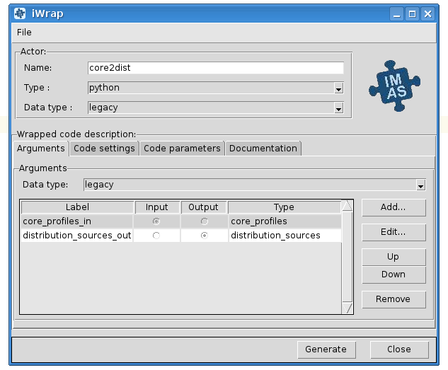

Scientific Worfklows : Wrapping user codes into actors - iWrap

1. [Scientific Worfklows](index.md)

 Scientific Worfklows : Wrapping user codes into actors - iWrap
=================================================================

 
 
 
 
 
 
 
 Created by  Bartosz Palak, last modified on 21 wrz 2021
 

Disclaimer

iWrap is currently being actively developed, so it is not publicly available yet. The first 'production' release is planned at the begin of 2022. 

  

* [1. Introduction](#WrappingusercodesintoactorsiWrap-Introduction)

	+ [1.1. Motivations](#WrappingusercodesintoactorsiWrap-Motivations)
	+ [1.2. iWrap - actor generator](#WrappingusercodesintoactorsiWrap-iWrap-actorgenerator)
* [2. Preparation of code](#WrappingusercodesintoactorsiWrap-Preparationofcode)

* [3. Code and actor description](#WrappingusercodesintoactorsiWrap-Codeandactordescription)

	+ [3.1.  YAML file syntax](#WrappingusercodesintoactorsiWrap-YAMLfilesyntax)
	+ [3.2. Native code description](#WrappingusercodesintoactorsiWrap-Nativecodedescription)
		- [3.2.1. Common part](#WrappingusercodesintoactorsiWrap-Commonpart)
		- [3.2.2. Language specific part - Fortran/C++](#WrappingusercodesintoactorsiWrap-Languagespecificpart-Fortran/C++)
		- [3.2.3. Example - Fortran code description](#WrappingusercodesintoactorsiWrap-Example-Fortrancodedescription)
	+ [3.3. Actor description](#WrappingusercodesintoactorsiWrap-Actordescription)
		- [3.3.1. Actor description syntax](#WrappingusercodesintoactorsiWrap-Actordescriptionsyntax)
		- [3.3.2. Example](#WrappingusercodesintoactorsiWrap-Example)
* [4. Actor generation](#WrappingusercodesintoactorsiWrap-Actorgeneration)

	+ [4.1. iWrap commandline](#WrappingusercodesintoactorsiWrap-iWrapcommandline)
	+ [4.2.  iWrap graphical interface](#WrappingusercodesintoactorsiWrap-iWrapgraphicalinterface)
* [5. Usage of actor within workflow](#WrappingusercodesintoactorsiWrap-Usageofactorwithinworkflow)

	+ [5.1. Actor import and creation](#WrappingusercodesintoactorsiWrap-Actorimportandcreation)
	+ [5.2. Actor runtime settings](#WrappingusercodesintoactorsiWrap-Actorruntimesettings)
	+ [5.3. Actor life cycle](#WrappingusercodesintoactorsiWrap-Actorlifecycle)
	+ [5.4. The simplest workflow](#WrappingusercodesintoactorsiWrap-Thesimplestworkflow)
	+ [5.5.  Workflow example](#WrappingusercodesintoactorsiWrap-Workflowexample)

1.Introduction
===============

Glossary

***Scenario (aka workflow)***

* A set of components (actors) constituting a directed graph to execute a computing algorithm

* Actors are dependent: a control and data is passed from actor to actor

* Usually the order of actors execution and the way how data are passed from actor to actor is managed by so called "workflow system". Such manager can be a simple script (codes) or more sophisticated "orchestrator" (e.g. Kepler)

***Actor***

* A basic component of scenario / workflow

* An actor performs some actions (e.g. computations, visualisation, etc)

* Usually given actor consumes results provided by a previous actor in a scenario and produces data for a next actor in a scenario

* Actor API strictly depends on targeted workflow system: an orchestrator "fires" particular actions on actor

* An actor, using its internal mechanisms ('wrappers') calls '*native code'* method(s), usually written in other language than an actor

**Native code**

* A physics code, of standardised signature, provided by software developer

1.1. Motivations
----------------

Complex simulations often combines a number of physics codes, potentially provided by various actors and written in different programming languages. To make them working together, an additional layer, that 'orchestrates' execution of particular codes, and takes care on passing data between 'producers' and 'consumers' is needed. Sometimes the functionality of such layer is provided by dedicated software (aka 'workflow orchestrators', like Kepler <https://kepler-project.org/>), sometimes it can be handled by much simpler mechanism like Python scripts.  Unfortunately all components ('actors') that constitute a computing scenario ('workflow') must be implemented in the same programming language, defining the same API.

Unfortunately, in most cases, scientific, simulation codes that performs computing intensive calculations  (due to performance reasons) are written in C++ or Fortran, while 'workflow orchestrators' are implemented in (more popular nowadays) languages, like Java, Python, etc. Hence the need for a 'wrapper' that intermediates between native code language and language of the orchestrator. Such wrappers can be developed manually, however users may benefit from a tool that automatise this process - iWrap

1.2. iWrap - actor generator
----------------------------

iWrap is a modular component generator, implemented in Python, used for creating IMAS actors from physics models. This mechanism allows to integrate physics codes written in one language (Fortran, CPP) within complex computing scenarios designed in other language (e.g. Python).

It's plug-in based modular design with clear separation of concerns allows to generate various types of actors and easily change data access paradigm (from dataset descriptor for AL to direct HDC data for instance)

***iWrap goals:***

* iWrap creates a Python script (aka an actor) that:

	+ calls a user code
	+ provides error handling
	+ calls debugger (if run in "debug" mode)
	+ runs MPI code
* iWrap generates a Fortran/CPP wrapper, which intermediates between Python script (workflow) and user code in terms of:

	+ reading/writing of in/out physical data (IDS)
	+ passing other arguments to/from the actor

***iWrap interfaces:***

For user conveniency it provides two kinds of interfaces:

* user friendly *graphical interface* that allows non-experienced users to define an actor in intuitive way and

* *command line interface* foreseen for more advanced users that may want to e.g. automatise actor generation process using scripts.

2.Preparation of code
======================

A signature of user code must follow strict rules to allow interaction between it and wrapping actor.  Please use following [>>link<<](iWrap---native-code-API_70877452.md) to get detailed guidelines for integration of native code into workflows using iWrap  

3.Code and actor description
=============================

iWrap, to properly wrap the code, needs detailed informations about both: the wrapped code and an actor to be generated. A formal description of the code provides information about the programming language used, arguments passed to/from the code, type of these arguments, etc, etc, while an actor description tells iWrap how to name generated actor, where to put it, etc. Such descriptions has to be provided in YAML format file, prepared manually, or automatically with help of iWrap GUI.

Hint

iWrap GUI allows to generate an actor without the need for manual preparation of actor/code description. 

  

3.1.  YAML file syntax
----------------------

The YAML file consists of two independent parts (aka 'YAML documents'), marked by tags corresponding to their roles: `actor_description` and `code_description`. Only *code description* part is mandatory, and  *actor description* could be provided in a file, or using iWrap commandline switches or interacting with GUI.

The structure of the file is following:

  

**iwrap_file.yaml**

`
# actor description part - optional 
--- !actor_description
	<see chapter below for details>
...

# code description part - mandatory
 --- !code_description  
 	<see chapter below for details> 
...
 
`

  

  

* All YAML fields are *MANDATORY*, unless explicitly described as *OPTIONAL*

* A code description part must begin with `"--- !code_description"`

  

3.2. Native code description
----------------------------

Description of the native code has to be provided as a YAML document. It consist of two parts. The first one contains generic information common for all languages, The latter one contains information specific for a given language of the native code (currently defined only for Fortran and CPP). 

  

Root directory

Root directory for all relative paths to files included in code description is on of the following:

* A directory containing YAML file from which project was loaded

* A directory from which iWrap was run (if not loaded from file)

  

### 3.2.1. Common part

 Generic information common for all (or at least majority of) programming languages.

* `programming_language`   

	+ meaning:  language of physics code
	+ value: one of predefined values: 'Fortran', 'CPP'
	+ example: 'Fortran'
* *`code_name`*   

	+ meaning:
		- name of user method / subroutine to be called,
		- must be **exactly the same** as name of called method / subroutine
		- it is used also as an actor name and the name of directory where actor is installed
	+ value: string
	+ example: 'my_subroutine'
* *`data_type`*   

	+ meaning: data type handled by the physics code
	+ value: 'legacy' (currently only 'Legacy IDS' type has been implemented)
	+ example: 'legacy'
* *`arguments`* *-*list of arguments

	+ argument definition:
		- *name*:
			* meaning: user defined argument name
			* value: string
			* example: equilibrium00
		- *type*:
			* meaning: a type of an IDS argument
			* value:
				+ predefined name of one of the IDSes
			* example: 'equilibrium'
		- intent
			* meaning: determines if given argument is input or output one
			* value: predefined - string "IN", "OUT"
* `*code_path*:`

	+ meaning: path to system library (C, CPP) , script (Python), etc containing the physics code, including method/subroutine to be run
	+ value: string, valid path to file
	+ example: 'any text'
* *`code_parameters`*- a structure containing `parameters` and schema `entry`:

	+ `parameters` :
		- meaning: path to XML file containing user defined parameters of the physics code
		- value: string, valid path to file
		- example: './code_parameters/parameters.xml'
	+ `schema` :
		- meaning: path to XSD file contains schema of XML parameters, to be able to validate them
		- value: string, valid path to file
		- example: './code_parameters/parameters.xsd'
* *`documentation` :*

	+ meaning: human readable description of native code
	+ value: string
	+ example: 'any text'

### 3.2.2. Language specific part - Fortran/C++

* `compiler` :

	+ meaning: the name/vendor of the compiler (and not compiler command!) used to compile native codes
	+ value: string, one of vendors of compilers, currently: 'Intel' or 'GCC'
	+ example: 'Intel'
* `mpi_flavour`   

	+ meaning: MPI compiler flavour to be used
	+ values: string, one of:  MPICH, MPICH2, MVAPICH2, OpenMPI, etc.
	+ example 'MPICH2'
* `open_mp` :

	+ meaning: if user code should be compiled with OpenMP flag
	+ values: boolean
	+ example 'true'
* *`system_libraries` :*

	+ meaning: a list of system libraries, managed using *pkg-config* mechanism,  that has to be used while native code linking
	+ value: a list of system libraries names, as they are published by *pkg-config*
	+ example: 
	
	
	
	| `- fftw3f- glib- mkl` |
* `custom_libraries` :

	+ meaning: additional libraries, not managed by *pkg-config* mechanism, necessary to link of the physics code:
	+ value:  a list of paths to libraries
	+ example: 
	
	
	
	| `- ./lib/custom/libcustom1.a- ./lib/custom/libcustom2.a` |

### 3.2.3. Example - Fortran code description

  

**fortran_code.yaml**

`
--- !code_description
programming_language: Fortran
code_name: demo_code
data_type: legacy
arguments:
-   name: equilibrium00
    type: equilibrium
    intent: IN
-   name: equilibrium11
    type: equilibrium
    intent: OUT
code_path: ./lib/libmy_lib.a
code_parameters:
    parameters: ./code_paramneters/parameters.xml
    schema: ./code_paramneters/parameters.xsd
documentation: 'Lorem ipsum dolor sit amet, consectetur adipiscing elit, sed do
    eiusmod tempor incididunt ut labore et dolore magna aliqua. Ut enim ad minim
    veniam... '
language_specific:
    compiler: Intel
    mpi_flavour: MPICH2
    open_mp: false
    system_libraries:
    - fftw3f
    - glib
    - mkl
    custom_libraries:
    - ./lib/custom/libcustom1.a
    - ./lib/custom/libcustom2.a
`

3.3. Actor description
----------------------

* All YAML fields are *MANDATORY*, unless explicitly described as *OPTIONAL*

* An actor description part must begin with `"--- !actor_description"`

### 3.3.1. Actor description syntax

  

* *`actor_name` :*

	+ meaning: the arbitrary, user defined name of the actor. It determines: the name of class to be generated and directory where actor will be put
	+ value: string
	+ example: 'core2dist'
* *`actor_type`:*

	+ meaning:
	+ values: 'python' (currently only python type has been implemented)
	+ example
* *`data_type`:*

	+ meaning: data type handled at the workflow level
	+ value: 'legacy' (currently only 'Legacy IDS' type has been implemented)
	+ example: 'legacy'
* *`install_dir`:*

	+ optional parameter
	+ meaning:  user chosen folder, where an actor will be installed
	+ values: string,
	+ example : /my/working/dir/IWRAP_ACTORS
	+ if not defined, a default installation directory will be used

### 3.3.2. Example

**actor_description.yaml**

`
--- !actor_description
actor_name: core2dist
actor_type: python
data_type: legacy
install_dir:  /my/working/dir/IWRAP_ACTORS
...
`

4.Actor generation
===================

4.1. iWrap commandline
----------------------

Once YAML file is prepared it can be used for generation of an actor using iWrap commandline.

`
usage: iwrap [-h] [-a ACTOR_NAME] [-t ACTOR_TYPE] [-d DATA_TYPE] [-f FILE]

optional arguments:
  -h, --help            show this help message and exit

Actor generation:
  -a ACTOR_NAME, --actor-name ACTOR_NAME
                        user defined name of the actor
  -t ACTOR_TYPE, --actor-type ACTOR_TYPE
                        type of an actor to be generated
  -d DATA_TYPE, --data-type DATA_TYPE
                        type of data to be used by the actor
  -f FILE, --file FILE  a path to code/actor description *.yaml file

`

  

If YAML file contains  both code description and actor description parts, no additional switches are required.

`
shell> iwrap -f actor_and_code_descriptions.yaml
`

  

If YAML contains only code description, additional information necessary to generate an actor must be provided. An actor name is mandatory switch in such case, while the other arguments (actor and data type) are optional - if they are absent, default values are used.

`
shell> iwrap -a actor_name -f code_descriptions.yaml
`

  

4.2.  iWrap graphical interface
-------------------------------

[>>here<<](iWrap---graphical-interface_70877876.md)

5.Usage of actor within workflow
=================================

5.1. Actor import and creation
------------------------------

To make an actor class visible inside a workflow script it has to be imported:

`
from <actor_package>.actor import <actor_class> 
`

In a current version both: *<actor_package>* and *<actor_class>*  are set to the same value provided by user as an *'actor name'.*

To import an actor named e.g. *'physics_ii*' a correct import will look like:

`
from physics_ii.actor import physics_ii 
`

An actor instance can be created using already imported actor class in 'usual pythonic' way:

`
actor_object = <actor name>()
e.g.
actor_object = physics_ii()
`

5.2. Actor runtime settings
---------------------------

Among the actor properties one is especially important: `runtime_settings.`  This property tells the wrapper how native code should be run and defines:

* Run mode

	+ Defined by setting: `<actor name>.runtime_settings.run_mode = value`
	+ Import of enumerated values: `from <actor name>.python_common.job_settings import RunMode`
	+ `RunMode.NORMAL` (default) - native code is called directly from Python, within the same process (and environment) that workflow script. Usually system resources, shared with other Python threads are limited, however this mode is suitable for most of the actors.
	+ `RunMode.STANDALONE` - an actor runs native code as executable in a separate system process, having its own environment and (usually) bigger system resources available. This mode is suitable e.g. for memory demanding code.
	+ Example: 
	
	
	
	`
	from physics_ii.python_common.job_settings import RunMode
	self.physics_ii.runtime_settings.run_mode = RunMode.STANDALONE
	`
* Debug mode:

	+ Defined by setting: `<actor name>.runtime_settings.debug_mode = value`
	+ Import of enumerated values: `from <actor name>.python_common.job_settings import DebugMode`
	+ `DebugMode.STANDALONE` - similarly to STANDALONE *run mode* - an actor runs native code as executable in a separate system process, but this time under debugger control. Debugged code can be run several times. To proceed with workflow execution is enough to close the debugger. This debugging mode is suitable for most of the purposes.
	+ `DebugMode.ATTACH` - an actor runs a debugger as parallel process, attaching it to a running workflow and setting breakpoint on wrapped native code of the debugged actor.  Because debugger attaches to a workflow (and not a particular actor) killing debugged process kills the whole workflow. This mode has to be chosen if the issue within code cannot be reproduced in STANDALONE mode and the issue results from actor interdependencies (e.g. one actor overwrites memory of the other one).
	+ Example: 
	
	
	
	`
	from physics_ii.python_common.job_settings import DebugMode
	self.physics_ii.runtime_settings.run_mode = DebugMode.STANDALONE
	`
* MPI settings

	+ Currently only number of nodes to run a code in parallel are defined
	+ Defined by setting: `<actor name>.runtime_settings.mpi.number_of_processes = value`
	+ Please note:
		- MPI code is run always in standalone mode
		- If a native code is not marked as 'MPI' during actor generation, this setting is ignored
* IDS storage settings:

	+ This attribute defines settings of temporary storage being used while passing IDSes between an actor and native code.
	+ Defined by setting: `<actor name>.runtime_settings.ids_storage.<storage_parameter> = value`
	+ Storage parameters that can be set:
		- `db_name:`
			* Meaning: name of data base to be used
			* Default value: 'tmp'
		- `shot:`
			* Meaning - shot number
			* Default value - 9999
		- `run` :
			* Meaning - run number
			* Default value - 9999
		- `backend:`
			* Meaning - backend to be used
			* Default value - `imas.imasdef.MEMORY_BACKEND`
		- `persistent_backend`
			* Meaning - backend to be used when temporary data cannot be stored in memory (e.g. while running actor in a standalone mode, when a native code is run as separate process, so it doesn't share memory with other actors.
			* Default value -  imas.imasdef.MDSPLUS_BACKEND
	+ Please note: for most of the purposes it is fine to not set this property and leave default values unchanged.
* Other settings - not yet implemented:

	+ Sandbox settings
	+ Batch job settings
	+ OpenMP settings

5.3. Actor life cycle
---------------------

During its 'life' an actor goes through several states, that can be passed only in a strict order:

* Creation of the object

`
actor_object = <actor name>()
e.g.
actor_object = physics_ii()
`
* Setting up the runtime settings

	+ Tuning up the actor before its initialization and native code execution
	+ See chapter above
* Actor initialisation:

	+ Calling `initialize()` method of the actor to perform internal initialisation actions
	
	
	
	`
	actor_object.initialize()
	`
* Native code call:

	+ This step can be repeated an arbitrary number of times
	+ `
	  <output IDS or list of IDSes> = actor_object(<input IDS/IDSes>)  
	e.g.
	  output_distribution_sources = actor_object(input_core_profiles)         
	`
* Actor finalisation

	+ Calling `finalize()` method of the actor to perform internal finalisation actions
	
	
	
	`
	actor_object.finalize()
	`

5.4. The simplest workflow
--------------------------

A skeleton of the very simple workflow could be implemented like this:

`
# Import of the actor class
from <actor name>.actor import <actor name> 

# Creation of actor object
actor_object = <actor name>()

# Reading input data
...

# Setting up runtime properties (if necessary)
...

# Actor initialisation
actor_object.initialize()

# Native code run     
<output IDS or list of IDSes>  = actor_object(<input IDS/IDSes>)  

# Actor finalisation
actor_object.finalize()

# Saving output data
...
`

  

5.5.  Workflow example
----------------------

`
import sys
import imas, os

from core2dist.actor import core2dist
from core2dist.python_common.job_settings import RunMode, DebugMode

class ExampleWorkflowManager:

    def __init__(self):
        self.actor_cp2ds = core2dist()
        self.input_entry = None
        self.output_entry = None

    def init_workflow(self):

        # INPUT/OUTPUT CONFIGURATION
        shot                = 134174
        run_in              = 37
        input_user_or_path  = 'public'
        input_database      = 'iter'
        run_out             = 10
        output_user_or_path = os.getenv('USER')
        output_database     = input_database

        # OPEN INPUT DATAFILE TO GET DATA FROM IMAS SCENARIO DATABASE
        print('=> Open input datafile')
        self.input_entry = imas.DBEntry(imas.imasdef.MDSPLUS_BACKEND,input_database,shot,run_in,input_user_or_path)
        self.input_entry.open()
        
        # CREATE OUTPUT DATAFILE
        print('=> Create output datafile')
        self.output_entry = imas.DBEntry(imas.imasdef.MDSPLUS_BACKEND,output_database,shot,run_out,output_user_or_path)
        self.output_entry.create()

        # # # # # # # # Initialization of ALL actors  # # # # # # # #
         #self.actor_cp2ds.runtime_settings.debug_mode = DebugMode.STANDALONE
         self.actor_cp2ds.initialize()
    
    def execute_workflow(self):
        # READ INPUT IDSS FROM LOCAL DATABASE
        print('=> Read input IDSs')
        input_core_profiles = self.input_entry.get('core_profiles')

        # EXECUTE PHYSICS CODE
        print('=> Execute physics code')

        output_distribution_sources = self.actor_cp2ds(input_core_profiles)        
        
        # SAVE IDSS INTO OUTPUT FILE
        print('=> Export output IDSs to local database')
        self.output_entry.put(output_distribution_sources)
        print('Done exporting.')

    def end_workflow(self):
        
        # Finalise ALL actors 
        self.actor_cp2ds.finalize()

        #other finalisation actions
        self.input_entry.close()
        self.output_entry.close()

manager = ExampleWorkflowManager()

manager.init_workflow()
manager.execute_workflow()
manager.end_workflow()
`

  

  

  

  

Attachments:
------------

 

Document generated by Confluence on 27 wrz 2021 14:37

[Atlassian](http://www.atlassian.com/)

 
