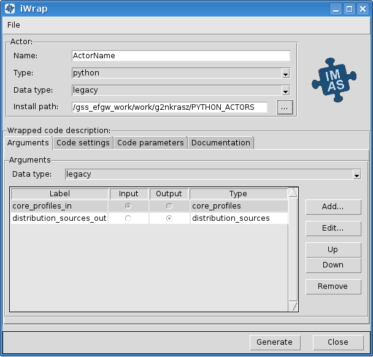
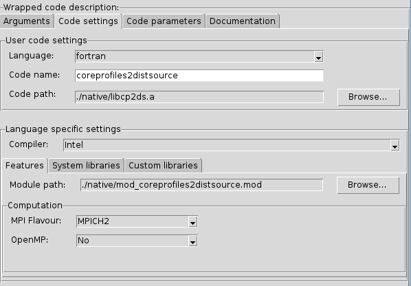
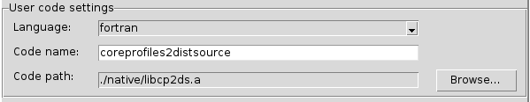
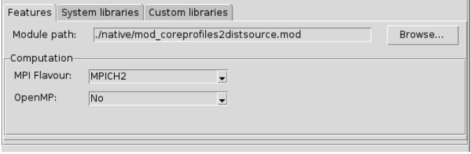
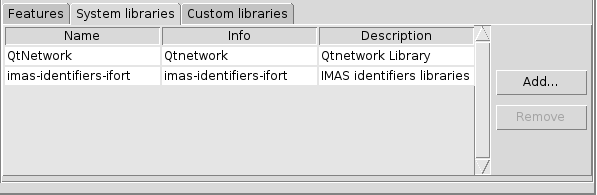
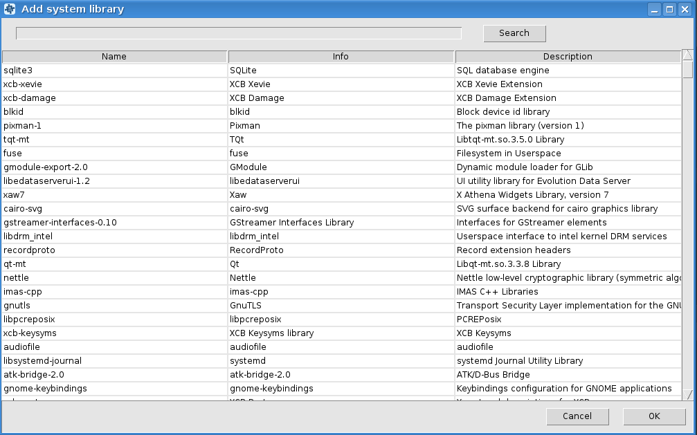
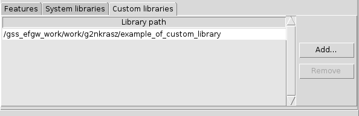
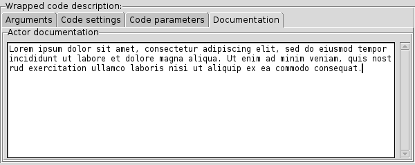

Scientific Worfklows : iWrap - graphical interface

1. [Scientific Worfklows](index.md)
2. [Wrapping user codes into actors - iWrap](Wrapping-user-codes-into-actors---iWrap_70877391.md)

 Scientific Worfklows : iWrap - graphical interface
=====================================================

 
 
 
 
 
 
 
 Created by  Bartosz Palak, last modified by  Natalia Kraszewska on 09 wrz 2021
 

* [1. iWrap purpose](#iWrapgraphicalinterface-iWrappurpose)

* [2. iWrap main window](#iWrapgraphicalinterface-iWrapmainwindow)

* [3. Actor description](#iWrapgraphicalinterface-Actordescription)

* [4. Code description](#iWrapgraphicalinterface-Codedescription)

	+ [4.1. Arguments](#iWrapgraphicalinterface-Arguments)
		- [4.1.1.  Add argument](#iWrapgraphicalinterface-Addargument)
		- [4.1.2. Edit argument](#iWrapgraphicalinterface-Editargument)
	+ [4.2. Code settings](#iWrapgraphicalinterface-Codesettings)
		- [4.2.1. User code settings](#iWrapgraphicalinterface-Usercodesettings)
		- [4.2.2. Language specific settings](#iWrapgraphicalinterface-Languagespecificsettings)
			* [4.2.2.1. Features](#iWrapgraphicalinterface-Features)
			* [4.2.2.2. System libraries](#iWrapgraphicalinterface-Systemlibraries)
				+ [4.2.2.2.1. Add system libraries](#iWrapgraphicalinterface-Addsystemlibraries)
			* [4.2.2.3. Custom libraries](#iWrapgraphicalinterface-Customlibraries)
	+ [4.3. Code parameters](#iWrapgraphicalinterface-Codeparameters)
	+ [4.4. Documentation](#iWrapgraphicalinterface-Documentation)

**This tutorial explains:**

* iWrap graphic user interface

* How to set up actor description

* How to set up code description

1.iWrap purpose
================

* iWrap generates a Fortran/CPP wrapper, which intermediates between Kepler actor and user code in terms of:

	+ reading/writing of in/out physical data (IDS)
	+ passing other arguments to/from the actor
* iWrap creates a Python script (aka an actor) that:

	+ calls a user code
	+ provides error handling
	+ calls debugger (if run in "debug" mode)

2.iWrap main window
====================

3.Actor description
====================

This group of graphical controls allows setting the description of the actor.

* **Name** - a user-defined name of the actor

* **Type** - a user-defined type of the actor

* **Data type** -  an actor data type

* **Install** **path** - path where actor will be installed

4.Code description
===================

4.1. Arguments
--------------

* **Data type** - an arguments data type

In the table, there are columns like:

* **Label** - user defined name of an argument

* **Input/Output** - defines argument as *an input/output*

* **Type** - defines an IDS based type of argument (e.g. equilibrium, topinfo, etc.)

  

On the right side of the table, there is a section with buttons. Add button allows to add a new argument, edit to edit argument and up/down buttons are changing the position of selected argument in the table. The remove button removes selected argument.

To change **Edit**, **Up**/**Down,** and **Remove** buttons state to active at least one argument has to be added to the table. 

### 4.1.1.  Add argument

To add new arguments click **Add...** button in the *Arguments* section. A new window named *iWrap - Add new argument* will appear. Filling label (argument can be also added with empty label) and selecting intent and type allow adding new argument by clicking **Add** button. Click **Cancel** to exit this window. 

### 4.1.2. Edit argument

There is also possible to edit arguments. When **Edit...** button in the *Arguments* section is clicked, a new window *iWrap - Edit argument* will appear. Change settings and approve it by clicking **Close** button. To exit the window click **Cancel**.

4.2. Code settings
------------------

### 4.2.1. User code settings

* **Language** - a user code language

* **Code** **name** - a user code name

* **Code** **path** - a user code path

### 4.2.2. Language specific settings

* **Compiler** - a compiler used to built library, available compilers are:

	+ Intel Fortran (ifort)
	+ GNU Compiler Collection (fortran)
	+ Intel

#### 4.2.2.1. Features

* **Module path** - path to the module

* **Computation**:

	+ **MPI Flavour** - MPI library, available compilers are:
		- MPICH2
		- OpenMPI
		- None - if actor isn't MPI based
	+ **OpenMP** - defines if usage of OpenMP directives is turned No/Yes

#### 4.2.2.2. System libraries

*System libraries* are system libraries handled by the pkg-config mechanism and required for building the user code.

In the table there is information about:

* **Name** - a library name

* **Info** - information about library

* **Description** - a library description

System library can be added and removed using buttons placed on the right side of the table.

To change **Remove** button state to active at least one system library has to be added and selected.

##### 4.2.2.2.1. Add system libraries

To add new arguments click **Add...** button in the *System libraries* section. A new window named *Add system library* will appear. *Search* field allows for easy filtering the list of libraries. To add a system library select your choice and click **Ok** button. To close window click **Cancel**.

#### 4.2.2.3. Custom libraries

*Custom libraries* are non-standard static libraries required for building the user code.

Available operations on libraries list:

* **Add...** - Adds a new library to the list

* **Remove** - Removes a new library from the list

  

To change **Remove** button state to active at least one library path has to be added and selected.

4.3. Code parameters
--------------------

*Code parameters* are all parameters that are specific to the code (like switches, scaling parameters, and parameters for built-in analytical models) as well as parameters to explicitly overrule fields in the IMAS data structures.

* **Code parameters file** - XML file contains code parameters

* **Schema file** - XSD file contains schema

4.4. Documentation
------------------

The *Documentation* tab specifies a user-defined actor description.

  

Attachments:
------------

 

Document generated by Confluence on 27 wrz 2021 14:37

[Atlassian](http://www.atlassian.com/)

 
