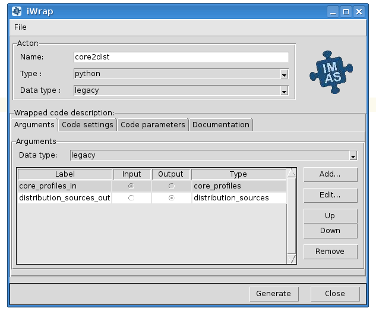

#######################################################################################################################
An actor usage and configuration
#######################################################################################################################

.. contents::
.. sectnum::

Actor import and creation
######################################################################################################################

To make an actor class accessible inside a workflow script it has to be imported:

  .. code::

     from <actor_package>.actor import <actor_class>

In a current version
both: *<actor_package>* and *<actor_class>*  are set to the
same value provided by user as an *'actor name'.*

To import an actor named e.g. *'physics_ii*' a correct
import will look like:

            .. container:: code panel pdl

               .. container:: codeContent panelContent pdl

                  .. code:: 

                     from physics_ii.actor import physics_ii 

            An actor instance can be created using already imported
            actor class in 'usual pythonic' way:

            .. container:: code panel pdl

               .. container:: codeContent panelContent pdl

                  .. code:: 

                     actor_object = <actor name>()
                     e.g.
                     actor_object = physics_ii()

            .. rubric:: 5.2.Actor runtime settings
               :name: WrappingusercodesintoactorsiWrap-Actorruntimesettings

            Among the actor properties one is especially important:
              runtime_settings.    This property tells the wrapper how
            native code should be run and defines:

            -  Run mode

               -  Defined by setting:
                    <actor name>.runtime_settings.run_mode = value  

               -  Import of enumerated values:
                    from <actor name>.python_common.job_settings import RunMode   

               -    RunMode.NORMAL   (default) - native code is called
                  directly from Python, within the same process (and
                  environment) that workflow script. Usually system
                  resources, shared with other Python threads are
                  limited, however this mode is suitable for most of the
                  actors.   

               -    RunMode.STANDALONE   - an actor runs native code as
                  executable in a separate system process, having its
                  own environment and (usually) bigger system resources
                  available. This mode is suitable e.g. for memory
                  demanding code.

               -  Example: 

                  .. container:: code panel pdl

                     .. container:: codeContent panelContent pdl

                        .. code:: 

                           from physics_ii.python_common.job_settings import RunMode
                           self.physics_ii.runtime_settings.run_mode = RunMode.STANDALONE

            -  Debug mode:

               -  Defined by setting:
                    <actor name>.runtime_settings.debug_mode = value  

               -  Import of enumerated values:
                    from <actor name>.python_common.job_settings import DebugMode   

               -    DebugMode.STANDALONE   - similarly to STANDALONE
                  *run mode* - an actor runs *native code as executable
                  in a separate system process*, but this time under
                  debugger control. Debugged code can be run several
                  times. To proceed with workflow execution is enough to
                  close the debugger. This debugging mode is suitable
                  for most of the purposes.   

               -    DebugMode.ATTACH   - an actor runs *a debugger as
                  parallel process, attaching it to a running workflow*
                  and setting breakpoint on wrapped native code of the
                  debugged actor.  Because debugger attaches to a
                  workflow (and not a particular actor) killing debugged
                  process kills the whole workflow. This mode has to be
                  chosen if the issue within code cannot be reproduced
                  in STANDALONE mode and the issue results from actor
                  interdependencies (e.g. one actor overwrites memory of
                  the other one).

               -  Example: 

                  .. container:: code panel pdl

                     .. container:: codeContent panelContent pdl

                        .. code:: 

                           from physics_ii.python_common.job_settings import DebugMode
                           self.physics_ii.runtime_settings.run_mode = DebugMode.STANDALONE

            -  MPI settings

               -  Currently only number of nodes to run a code in
                  parallel are defined
               -  Defined by setting:
                    <actor name>.runtime_settings.mpi.number_of_processes = value  
               -  Please note: 

                  -  MPI code is run always in standalone mode
                  -  If a native code is not marked as 'MPI' during
                     actor generation, this setting is ignored

            -  IDS storage settings:

               -  This attribute defines settings of temporary storage
                  being used while passing IDSes between an actor and
                  native code.
               -  Defined by setting:
                    <actor name>.runtime_settings.ids_storage.<storage_parameter> = value  
               -  Storage parameters that can be set:

                  -    db_name:   

                     -  Meaning: name of data base to be used
                     -  Default value: 'tmp'

                  -    shot:  

                     -  Meaning - shot number
                     -  Default value - 9999

                  -    run   :

                     -  Meaning - run number
                     -  Default value - 9999

                  -    backend:  

                     -  Meaning - backend to be used
                     -  Default value -   imas.imasdef.MEMORY_BACKEND   

                  -    persistent_backend   

                     -  Meaning - backend to be used when temporary data
                        cannot be stored in memory (e.g. while running
                        actor in a standalone mode, when a native code
                        is run as separate process, so it doesn't share
                        memory with other actors.
                     -  Default value -  imas.imasdef.MDSPLUS_BACKEND

               -  Please note: for most of the purposes it is fine to
                  not set this property and leave default values
                  unchanged.

            -  Other settings - not yet implemented:

               -  Sandbox settings
               -  Batch job settings
               -  OpenMP settings

            .. rubric:: 5.3.Actor life cycle
               :name: WrappingusercodesintoactorsiWrap-Actorlifecycle

            During its 'life' an actor goes through several states, that
            can be passed only in a strict order:

            -  Creation of the object

               .. container:: code panel pdl

                  .. container:: codeContent panelContent pdl

                     .. code:: 

                        actor_object = <actor name>()
                        e.g.
                        actor_object = physics_ii()

            -  Setting up the runtime settings

               -  Tuning up the actor before its initialization and
                  native code execution

               -  See chapter above

            -  Actor initialisation:

               -  Calling   initialize()   method of the actor to
                  perform internal initialisation actions

                  .. container:: code panel pdl

                     .. container:: codeContent panelContent pdl

                        .. code:: 

                           actor_object.initialize()

            -  Native code call:

               -  This step can be repeated an arbitrary number of times

               -  

                  .. container:: code panel pdl

                     .. container:: codeContent panelContent pdl

                        .. code:: 

                             <output IDS or list of IDSes> = actor_object(<input IDS/IDSes>)  
                           e.g.
                             output_distribution_sources = actor_object(input_core_profiles)         

            -  Actor finalisation

               -  Calling   finalize()   method of the actor to perform
                  internal finalisation actions

                  .. container:: code panel pdl

                     .. container:: codeContent panelContent pdl

                        .. code:: 

                           actor_object.finalize()

            .. rubric:: 5.4.The simplest workflow
               :name: WrappingusercodesintoactorsiWrap-Thesimplestworkflow

            A skeleton of the very simple workflow could be implemented
            like this:

            .. container:: code panel pdl

               .. container:: codeContent panelContent pdl

                  .. code:: 

                     # Import of the actor class
                     from <actor name>.actor import <actor name> 

                     # Creation of actor object
                     actor_object = <actor name>()

                     # Reading input data
                     ...

                     # Setting up runtime properties (if necessary)
                     ...

                     # Actor initialisation
                     actor_object.initialize()

                     # Native code run     
                     <output IDS or list of IDSes>  = actor_object(<input IDS/IDSes>)  

                     # Actor finalisation
                     actor_object.finalize()

                     # Saving output data
                     ...

            | 

            .. rubric:: 5.5. Workflow example
               :name: WrappingusercodesintoactorsiWrap-Workflowexample

            .. container:: code panel pdl

               .. container:: codeContent panelContent pdl

                  .. code:: 

                     import sys
                     import imas, os

                     from core2dist.actor import core2dist
                     from core2dist.python_common.job_settings import RunMode, DebugMode

                     class ExampleWorkflowManager:

                         def __init__(self):
                             self.actor_cp2ds = core2dist()
                             self.input_entry = None
                             self.output_entry = None

                         def init_workflow(self):

                             # INPUT/OUTPUT CONFIGURATION
                             shot                = 134174
                             run_in              = 37
                             input_user_or_path  = 'public'
                             input_database      = 'iter'
                             run_out             = 10
                             output_user_or_path = os.getenv('USER')
                             output_database     = input_database

                             # OPEN INPUT DATAFILE TO GET DATA FROM IMAS SCENARIO DATABASE
                             print('=> Open input datafile')
                             self.input_entry = imas.DBEntry(imas.imasdef.MDSPLUS_BACKEND,input_database,shot,run_in,input_user_or_path)
                             self.input_entry.open()
                             
                             # CREATE OUTPUT DATAFILE
                             print('=> Create output datafile')
                             self.output_entry = imas.DBEntry(imas.imasdef.MDSPLUS_BACKEND,output_database,shot,run_out,output_user_or_path)
                             self.output_entry.create()

                             # # # # # # # # Initialization of ALL actors  # # # # # # # #
                              #self.actor_cp2ds.runtime_settings.debug_mode = DebugMode.STANDALONE
                              self.actor_cp2ds.initialize()
                         
                         def execute_workflow(self):
                             # READ INPUT IDSS FROM LOCAL DATABASE
                             print('=> Read input IDSs')
                             input_core_profiles = self.input_entry.get('core_profiles')

                             # EXECUTE PHYSICS CODE
                             print('=> Execute physics code')

                             output_distribution_sources = self.actor_cp2ds(input_core_profiles)        
                             
                             # SAVE IDSS INTO OUTPUT FILE
                             print('=> Export output IDSs to local database')
                             self.output_entry.put(output_distribution_sources)
                             print('Done exporting.')

                         def end_workflow(self):
                             
                             # Finalise ALL actors 
                             self.actor_cp2ds.finalize()

                             #other finalisation actions
                             self.input_entry.close()
                             self.output_entry.close()

                     manager = ExampleWorkflowManager()

                     manager.init_workflow()
                     manager.execute_workflow()
                     manager.end_workflow()

            | 

.. |image2| image:: images/icons/bullet_blue.gif
   :width: 8px
   :height: 8px
