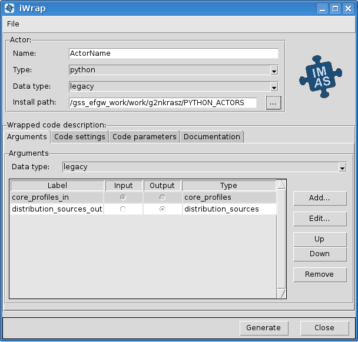
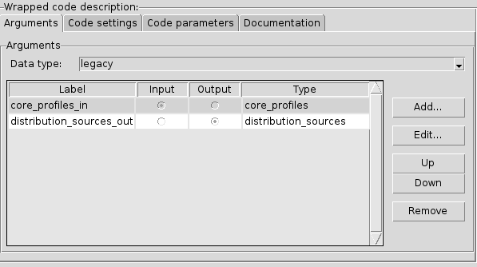
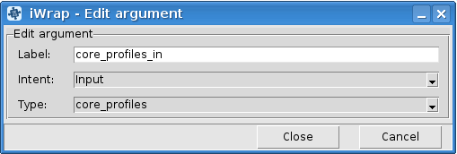
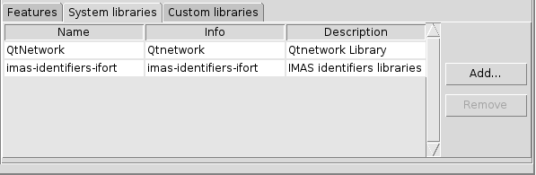
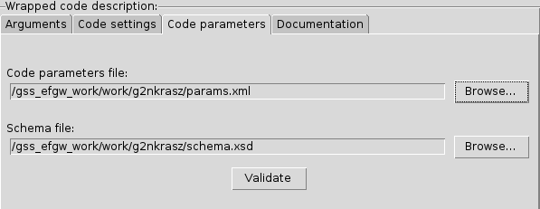

==================================================
Scientific Worfklows : iWrap - graphical interface
==================================================

.. container::
   :name: page

   .. container:: aui-page-panel
      :name: main

      .. container:: view
         :name: content

            .. note::

               .. container:: confluence-information-macro-body

                  **This tutorial explains:**

                  -  iWrap graphic user interface
                  -  How to set up actor description
                  -  How to set up code description

            .. rubric:: 1.iWrap purpose
               :name: iWrapgraphicalinterface-iWrappurpose

            -  iWrap generates a Fortran/CPP wrapper, which
               intermediates between Kepler actor and user code in terms
               of:

               -  reading/writing of in/out physical data (IDS)
               -  passing other arguments to/from the actor

            -  iWrap creates a Python script (aka an actor) that:

               -  calls a user code
               -  provides error handling
               -  calls debugger (if run in "debug" mode)

            .. rubric:: 2.iWrap main window
               :name: iWrapgraphicalinterface-iWrapmainwindow

            |image1|

            .. rubric:: 3.Actor description
               :name: iWrapgraphicalinterface-Actordescription

            |image2|

            This group of graphical controls allows setting the
            description of the actor.

            -  **Name** - a user-defined name of the actor
            -  **Type** - a user-defined type of the actor
            -  **Data type** -  an actor data type
            -  **Install path** - path where actor will be installed

            .. rubric:: 4.Code description
               :name: iWrapgraphicalinterface-Codedescription

            .. rubric:: 4.1.Arguments
               :name: iWrapgraphicalinterface-Arguments

            |image3|

            -  **Data type** - an arguments data type

            In the table, there are columns like:

            -  **Label** - user defined name of an argument
            -  **Input/Output** - defines argument as \ *an
               input/output*
            -  **Type** - defines an IDS based type of argument (e.g.
               equilibrium, topinfo, etc.)

            |

            On the right side of the table, there is a section with
            buttons. Add button allows to add a new argument, edit to
            edit argument and up/down buttons are changing the position
            of selected argument in the table. The remove button removes
            selected argument.

            .. note::

               .. container:: confluence-information-macro-body

                  To change **Edit**, **Up**/**Down,** and **Remove**
                  buttons state to active at least one argument has to
                  be added to the table.

            .. rubric:: 4.1.1. Add argument
               :name: iWrapgraphicalinterface-Addargument

            |image4|

            To add new arguments click **Add...** button in the
            *Arguments* section. A new window named *iWrap - Add new
            argument* will appear. Filling label (argument can be also
            added with empty label) and selecting intent and type allow
            adding new argument by clicking **Add** button. Click
            **Cancel** to exit this window.

            .. rubric:: 4.1.2.Edit argument
               :name: iWrapgraphicalinterface-Editargument

            |image5|

            There is also possible to edit arguments. When **Edit...**
            button in the *Arguments* section is clicked, a new window
            *iWrap - Edit argument* will appear. Change settings and
            approve it by clicking **Close** button. To exit the window
            click **Cancel**.

            .. rubric:: 4.2.Code settings
               :name: iWrapgraphicalinterface-Codesettings

            |image6|

            .. rubric:: 4.2.1.User code settings
               :name: iWrapgraphicalinterface-Usercodesettings

            |image7|

            -  **Language** - a user code language
            -  **Code** **name** - a user code name
            -  **Code** **path** - a user code path

            .. rubric:: 4.2.2.Language specific settings
               :name: iWrapgraphicalinterface-Languagespecificsettings

            |image8|

            -  **Compiler** - a compiler used to built library,
               available compilers are:

               -  Intel Fortran (ifort)
               -  GNU Compiler Collection (fortran)
               -  Intel

            .. rubric:: 4.2.2.1.Features
               :name: iWrapgraphicalinterface-Features

            |image9|

            -  **Module path** - path to the module
            -  **Computation**:

               -  **MPI Flavour** - MPI library, available compilers
                  are:

                  -  MPICH2
                  -  OpenMPI
                  -  None - if actor isn't MPI based

               -  **OpenMP** - defines if usage of OpenMP directives is
                  turned No/Yes

            .. rubric:: 4.2.2.2.System libraries
               :name: iWrapgraphicalinterface-Systemlibraries

            *System libraries*\ are system libraries handled by the
            pkg-config mechanism and required for building the user
            code.

            |image10|

            In the table there is information about:

            -  **Name** - a library name
            -  **Info** - information about library
            -  **Description** - a library description

            System library can be added and removed using buttons placed
            on the right side of the table.

            .. note::

                  To change **Remove** button state to active at least
                  one system library has to be added and selected.

            .. rubric:: 4.2.2.2.1.Add system libraries
               :name: iWrapgraphicalinterface-Addsystemlibraries

            To add new arguments click **Add...** button in the *System
            libraries* section. A new window named *Add system library*
            will appear. *Search* field allows for easy filtering the
            list of libraries. To add a system library select your
            choice and click **Ok** button. To close window click
            **Cancel**.

            |image11|

            .. rubric:: 4.2.2.3.Custom libraries
               :name: iWrapgraphicalinterface-Customlibraries

            *Custom libraries* are non-standard static libraries
            required for building the user code.

            |image12|

            Available operations on libraries list:

            -  **Add...** - Adds a new library to the list
            -  **Remove** - Removes a new library from the list

            |

            .. container::
            .. note::

               .. container:: confluence-information-macro-body

                  To change **Remove** button state to active at least
                  one library path has to be added and selected.

            .. rubric:: 4.3.Code parameters
               :name: iWrapgraphicalinterface-Codeparameters

            *Code parameters*\ are all parameters that are specific to
            the code (like switches, scaling parameters, and parameters
            for built-in analytical models) as well as parameters to
            explicitly overrule fields in the IMAS data structures.

            |image13|

            -  **Code parameters file** - XML file contains code
               parameters
            -  **Schema file** - XSD file contains schema

            .. rubric:: 4.4.Documentation
               :name: iWrapgraphicalinterface-Documentation

            The\ *Documentation*\ tab specifies a user-defined actor
            description.

            |image14|

            |

.. |image2| image:: attachments/70877876/70879107.png
   :class: confluence-embedded-image
   :width: 450px

.. |image4| image:: attachments/70877876/70879061.png
   :class: confluence-embedded-image
   :width: 450px

.. |image6| image:: attachments/70877876/70879045.png
   :class: confluence-embedded-image
   :width: 450px
.. |image7| image:: attachments/70877876/70879046.png
   :class: confluence-embedded-image
   :width: 450px
.. |image8| image:: attachments/70877876/70879048.png
   :class: confluence-embedded-image
   :width: 450px
.. |image9| image:: attachments/70877876/70879070.png
   :class: confluence-embedded-image
   :width: 450px

.. |image11| image:: attachments/70877876/70878345.png
   :class: confluence-embedded-image
   :width: 500px
.. |image12| image:: attachments/70877876/70879051.png
   :class: confluence-embedded-image
   :width: 450px

.. |image14| image:: attachments/70877876/70879053.png
   :class: confluence-embedded-image
   :width: 450px
.. |image15| image:: images/icons/bullet_blue.gif
   :width: 8px
   :height: 8px
.. |image16| image:: images/icons/bullet_blue.gif
   :width: 8px
   :height: 8px
.. |image17| image:: images/icons/bullet_blue.gif
   :width: 8px
   :height: 8px
.. |image18| image:: images/icons/bullet_blue.gif
   :width: 8px
   :height: 8px
.. |image19| image:: images/icons/bullet_blue.gif
   :width: 8px
   :height: 8px
.. |image20| image:: images/icons/bullet_blue.gif
   :width: 8px
   :height: 8px
.. |image21| image:: images/icons/bullet_blue.gif
   :width: 8px
   :height: 8px
.. |image22| image:: images/icons/bullet_blue.gif
   :width: 8px
   :height: 8px
.. |image23| image:: images/icons/bullet_blue.gif
   :width: 8px
   :height: 8px
.. |image24| image:: images/icons/bullet_blue.gif
   :width: 8px
   :height: 8px
.. |image25| image:: images/icons/bullet_blue.gif
   :width: 8px
   :height: 8px
.. |image26| image:: images/icons/bullet_blue.gif
   :width: 8px
   :height: 8px
.. |image27| image:: images/icons/bullet_blue.gif
   :width: 8px
   :height: 8px
.. |image28| image:: images/icons/bullet_blue.gif
   :width: 8px
   :height: 8px
.. |image29| image:: images/icons/bullet_blue.gif
   :width: 8px
   :height: 8px
.. |image30| image:: images/icons/bullet_blue.gif
   :width: 8px
   :height: 8px
.. |image31| image:: images/icons/bullet_blue.gif
   :width: 8px
   :height: 8px
.. |image32| image:: images/icons/bullet_blue.gif
   :width: 8px
   :height: 8px
.. |image33| image:: images/icons/bullet_blue.gif
   :width: 8px
   :height: 8px
.. |image34| image:: images/icons/bullet_blue.gif
   :width: 8px
   :height: 8px
.. |image35| image:: images/icons/bullet_blue.gif
   :width: 8px
   :height: 8px
.. |image36| image:: images/icons/bullet_blue.gif
   :width: 8px
   :height: 8px
.. |image37| image:: images/icons/bullet_blue.gif
   :width: 8px
   :height: 8px
.. |image38| image:: images/icons/bullet_blue.gif
   :width: 8px
   :height: 8px
.. |image39| image:: images/icons/bullet_blue.gif
   :width: 8px
   :height: 8px
.. |image40| image:: images/icons/bullet_blue.gif
   :width: 8px
   :height: 8px
.. |image41| image:: images/icons/bullet_blue.gif
   :width: 8px
   :height: 8px
.. |image42| image:: images/icons/bullet_blue.gif
   :width: 8px
   :height: 8px
.. |image43| image:: images/icons/bullet_blue.gif
   :width: 8px
   :height: 8px
.. |image44| image:: images/icons/bullet_blue.gif
   :width: 8px
   :height: 8px
.. |image45| image:: images/icons/bullet_blue.gif
   :width: 8px
   :height: 8px
.. |image46| image:: images/icons/bullet_blue.gif
   :width: 8px
   :height: 8px
.. |image47| image:: images/icons/bullet_blue.gif
   :width: 8px
   :height: 8px
.. |image48| image:: images/icons/bullet_blue.gif
   :width: 8px
   :height: 8px
.. |image49| image:: images/icons/bullet_blue.gif
   :width: 8px
   :height: 8px
.. |image50| image:: images/icons/bullet_blue.gif
   :width: 8px
   :height: 8px
.. |image51| image:: images/icons/bullet_blue.gif
   :width: 8px
   :height: 8px
.. |image52| image:: images/icons/bullet_blue.gif
   :width: 8px
   :height: 8px
.. |image53| image:: images/icons/bullet_blue.gif
   :width: 8px
   :height: 8px
.. |image54| image:: images/icons/bullet_blue.gif
   :width: 8px
   :height: 8px
.. |image55| image:: images/icons/bullet_blue.gif
   :width: 8px
   :height: 8px
.. |image56| image:: images/icons/bullet_blue.gif
   :width: 8px
   :height: 8px
.. |image57| image:: images/icons/bullet_blue.gif
   :width: 8px
   :height: 8px
.. |image58| image:: images/icons/bullet_blue.gif
   :width: 8px
   :height: 8px
.. |image59| image:: images/icons/bullet_blue.gif
   :width: 8px
   :height: 8px
.. |image60| image:: images/icons/bullet_blue.gif
   :width: 8px
   :height: 8px
.. |image61| image:: images/icons/bullet_blue.gif
   :width: 8px
   :height: 8px
.. |image62| image:: images/icons/bullet_blue.gif
   :width: 8px
   :height: 8px