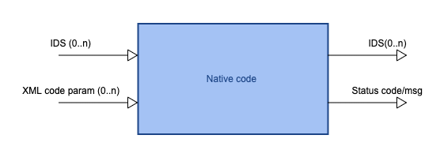

:orphan:
==============================================
Scientific Worfklows : iWrap - native code API
==============================================

.. container::
   :name: page

   .. container:: aui-page-panel
      :name: main

      .. container::
         :name: main-header

         .. container::
            :name: breadcrumb-section

            #. `Scientific Worfklows <index.html>`__
            #. `Wrapping user codes into actors -
               iWrap <Wrapping-user-codes-into-actors---iWrap_70877391.html>`__

         .. rubric:: Scientific Worfklows : iWrap - native code API
            :name: title-heading
            :class: pagetitle

      .. container:: view
         :name: content

         .. container:: page-metadata

            Created by Bartosz Palak, last modified on 23 Nov 2021

         .. container:: wiki-content group
            :name: main-content

            .. container:: toc-macro rbtoc1637669703690

               -  `1. Introduction <#iWrapnativecodeAPI-Introduction>`__
               -  `2. The method
                  API <#iWrapnativecodeAPI-ThemethodAPI>`__

                  -  `2.1.
                     Initialisation method <#iWrapnativecodeAPI-Initialisationmethod>`__
                  -  `2.2. Main
                     method <#iWrapnativecodeAPI-Mainmethod>`__
                  -  `2.3. Finalize
                     method <#iWrapnativecodeAPI-Finalizemethod>`__

               -  `3. API
                  implementation <#iWrapnativecodeAPI-APIimplementation>`__

                  -  `3.1. Fortran <#iWrapnativecodeAPI-Fortran>`__

                     -  `3.1.1. Native code
                        signature <#iWrapnativecodeAPI-Nativecodesignature>`__
                     -  `3.1.2. Module <#iWrapnativecodeAPI-Module>`__
                     -  `3.1.3.
                        Subroutines <#iWrapnativecodeAPI-Subroutines>`__
                     -  `3.1.4.
                        Arguments <#iWrapnativecodeAPI-Arguments>`__

                  -  `3.2. Example <#iWrapnativecodeAPI-Example>`__
                  -  `3.3.  C++ <#iWrapnativecodeAPI-C++>`__

                     -  `3.3.1. Native code
                        signature <#iWrapnativecodeAPI-Nativecodesignature.1>`__
                     -  `3.3.2. Header <#iWrapnativecodeAPI-Header>`__
                     -  `3.3.3. Method <#iWrapnativecodeAPI-Method>`__
                     -  `3.3.4.
                        Arguments <#iWrapnativecodeAPI-Arguments.1>`__
                     -  `3.3.5.
                        Example <#iWrapnativecodeAPI-Example.1>`__

               -  `4. MPI <#iWrapnativecodeAPI-MPI>`__
               -  `5. Code
                  packaging <#iWrapnativecodeAPI-Codepackaging>`__

            .. rubric:: 1.Introduction
               :name: iWrapnativecodeAPI-Introduction

            .. container::
            .. warning::

               .. container:: confluence-information-macro-body

                  A signature of user code must follow strict rules to
                  be wrapped by iWrap - without the detailed knowledge
                  of method signature iWrap cannot built an actor.

            | 

            iWrap actor calls three methods of the native code:

            -  The initialisation method
            -  The main ("step") method
            -  The finalisation method

            Signatures of methods may differ, depending of features of
            programming language being used, however the main principia
            remains the same. 

            .. rubric:: 2.The method API
               :name: iWrapnativecodeAPI-ThemethodAPI

            .. rubric:: 2.1.Initialisation method
               :name: iWrapnativecodeAPI-Initialisationmethod

            +-----------------------------------------------------------------------+
            | +----------+                                                          |
            | | |image1| |                                                          |
            | +----------+                                                          |
            +-----------------------------------------------------------------------+

            -  An optional method used for set-up of native code
            -  If provided - the method is called only, when an actor
               isinitialised - The method must be run **before** a call
               of *main* and *finalisation *\ (if provided)
            -  The method can be of arbitrary name (the name has to be
               specified in the code YAML description)
            -  Method arguments:

               -  Code parameters:

                  -  **Optional**\  argument
                  -  Type: string
                  -  Intent: IN

            -  

               -  Status code:

                  -  **Mandatory**\  argument
                  -  Type: Integer
                  -  Intent: OUT

            -  

               -  Status message

                  -  **Mandatory**\  argument
                  -  Type: string
                  -  Intent: OUT

            | 

            .. rubric:: 2.2.Main method
               :name: iWrapnativecodeAPI-Mainmethod

            +-----------------------------------------------------------------------+
            | +----------+                                                          |
            | | |image2| |                                                          |
            | +----------+                                                          |
            +-----------------------------------------------------------------------+

            -  A **mandatory** method that native code **must** provide
            -  The method can be run an arbitrary numer of times (e.g.
               in a loop)
            -  It can be of arbitrary name (the name has to be specified
               in the code YAML description)
            -  The method must be run **after** a call of
               *initialisation* (if provided) and **before** a call
               of *finalisation *\ (if provided)
            -  Method arguments:

               -  Input and output IDSes:

                  -  **Optional**\  arguments
                  -  Intent: IN or OUT

               -  XML parameters:

                  -  **Optional**\  argument
                  -  Intent: IN

               -  Status code:

                  -  **Mandatory**\  argument
                  -  Type: Integer
                  -  Intent: OUT

            -  

               -  Status message

                  -  **Mandatory**\  argument
                  -  Type: string
                  -  Intent: OUT

            .. rubric:: 2.3.Finalize method
               :name: iWrapnativecodeAPI-Finalizemethod

            +-----------------------------------------------------------------------+
            | +----------+                                                          |
            | | |image3| |                                                          |
            | +----------+                                                          |
            +-----------------------------------------------------------------------+

            | 

            -  An optional method that is usually called to clean-up
               environment
            -  The method can be run an arbitrary numer of times
            -  The method can be of arbitrary name (the name has to be
               specified in the code YAML description)
            -  Method arguments:

               -  Status code:

                  -  **Mandatory**\  argument
                  -  Type: Integer
                  -  Intent: OUT

            -  

               -  Status message

                  -  **Mandatory**\  argument
                  -  Type: string
                  -  Intent: OUT

            | 

            .. container::
            .. warning::

               Important!

               .. container:: confluence-information-macro-body

                  A native code wrapped by iWrap that will become a part
                  of workflow should be compiled using the same
                  environment in which workflow will be run!

            | 

            .. rubric:: 3.API implementation
               :name: iWrapnativecodeAPI-APIimplementation

            .. rubric:: 3.1.Fortran
               :name: iWrapnativecodeAPI-Fortran

            .. rubric:: 3.1.1.Native code signature
               :name: iWrapnativecodeAPI-Nativecodesignature

            | 

            .. container:: code panel pdl

               .. container:: codeContent panelContent pdl

                  .. code:: 

                     module <module name>
                      
                     !
                     !    INITIALISATION SUBROUTINE
                     !
                       subroutine <init subroutine name> ([xml_parameters,] status_code, status_message)
                       use ids_schemas
                       
                       ! XML code parameters
                       type(ids_parameters_input) :: xml_parameters
                      
                       ! status info
                       integer, intent(OUT) :: status_code
                       character(len=:), pointer, intent(OUT) :: status_message
                      
                     end subroutine <init subroutine name> 

                     subroutine <subroutine name> ([ids1, ids2, ..., idsN,] [xml_parameters], status_code, status_message)
                       use ids_schemas
                       ! IN/OUT IDSes
                       type(ids_<ids_name>), intent([IN|OUT]):: ids1
                       type(ids_<ids_name>), intent([IN|OUT]):: ids2
                        . . .
                       type(ids_<ids_name>), intent([IN|OUT]):: idsN 
                      
                       ! XML code parameters
                       type(ids_parameters_input) :: xml_parameters
                      
                       ! status info
                       integer, intent(OUT) :: status_code
                       character(len=:), pointer, intent(OUT) :: status_message
                      
                     end subroutine <subroutine name>

                     !
                     !    FINALISATION SUBROUTINE
                     !
                     subroutine <finish subroutine name> (status_code, status_message)
                       use ids_schemas
                      
                       ! status info
                       integer, intent(OUT) :: status_code
                       character(len=:), pointer, intent(OUT) :: status_message
                      
                     end subroutine <finish subroutine name>   
                     end module <module name>

            | 

            .. rubric:: 3.1.2.Module
               :name: iWrapnativecodeAPI-Module

            -  Native code should be put within a module
            -  Module is used by compiler to check, if code signature
               expected by wrapper is exactly the same as provided.
            -  A name of the module could be arbitrary - chosen by code
               developer

            .. rubric:: 3.1.3.Subroutines
               :name: iWrapnativecodeAPI-Subroutines

            -  A user code should be provided as subroutines (and not a
               functions)
            -  A name of subroutines could be arbitrary - chosen by code
               developer
            -  A name of the module could be arbitrary - chosen by code
               developer
            -  Arguments shall be provided in a strict order
            -  No INOUT arguments are allowed!

            .. rubric:: 3.1.4.Arguments
               :name: iWrapnativecodeAPI-Arguments

            *Initialisation subroutine:*

            -  XML parameters:

               -  **Optional**\  argument
               -  Intent: IN
               -  Defined as
                  "  type(ids_parameters_input), intent(IN)"   

            -  Status code:

               -  **Mandatory**\  argument
               -  Intent: OUT
               -  Defined as  "  integer, intent(OUT)"  \  

            -  Status message

               -  **Mandatory**\  argument
               -  Intent: OUT
               -  Defined
                  as: \   character(len=:), pointer, intent(OUT)   

            *Main subroutine:*

            -  Input and output IDSes:

               -  **Optional**\  arguments
               -  Intent: IN or OUT
               -  Defined as "  type(ids_<ids_name>)  \  "

            -  XML parameters:

               -  **Optional**\  argument
               -  Intent: IN
               -  Defined as
                  "  type(ids_parameters_input), intent(IN)"   

            -  Status code:

               -  **Mandatory**\  argument
               -  Intent: OUT
               -  Defined as  "  integer, intent(OUT)"  \  

            -  Status message

               -  **Mandatory**\  argument
               -  Intent: OUT
               -  Defined
                  as: \   character(len=:), pointer, intent(OUT)   

            *Finalisation subroutine:*

            -  Status code:

               -  **Mandatory**\  argument
               -  Intent: OUT
               -  Defined as  "  integer, intent(OUT)"  \  

            -  Status message

               -  **Mandatory**\  argument
               -  Intent: OUT
               -  Defined
                  as: \   character(len=:), pointer, intent(OUT)   

            .. rubric:: 3.2.Example
               :name: iWrapnativecodeAPI-Example

            .. container:: code panel pdl

               .. container:: codeContent panelContent pdl

                  .. code:: 

                     module physics_ii_mod
                       
                         !
                         !    INITIALISATION SUBROUTINE
                         !
                     subroutine init_code (xml_parameters, status_code, status_message)
                         use ids_schemas, only: ids_parameters_input
                         implicit none
                         type(ids_parameters_input) :: xml_parameters
                         integer, intent(out) :: status_code
                         character(len=:), pointer, intent(out) :: status_message

                         ! Setting status to SUCCESS
                         status_code = 0
                         allocate(character(50):: status_message)
                         status_message = 'OK'

                         write(*,*) '============ The subroutine body ============='

                     end subroutine init_code

                         !
                         !    MAIN SUBROUTINE
                         ! 

                     subroutine physics_ii(equilibrium_in, equilibrium_out, code_param, error_flag, error_message)      

                       use ids_schemas   

                       ! IN/OUT IDSes
                       type(ids_equilibrium):: equilibrium_in, equilibrium_out
                      
                       ! XML code parameters
                       type(ids_parameters_input) :: code_param
                      
                       ! status info
                       integer, intent(out) :: error_flag
                       character(len=:), pointer, intent(out) :: error_message
                      
                     end subroutine physics_ii

                         !
                         !    FINALISATION SUBROUTINE
                         !
                     subroutine clean_up(status_code, status_message)
                         implicit none
                         integer, intent(out) :: status_code
                         character(len=:), pointer, intent(out) :: status_message

                         ! Setting status to SUCCESS
                         status_code = 0
                         allocate(character(50):: status_message)
                         status_message = 'OK'

                         write(*,*) '============ The subroutine body =============' 

                     end subroutine clean_up

                     end module physics_ii_mod

            .. rubric:: 3.3. C++
               :name: iWrapnativecodeAPI-C++

            .. rubric:: 3.3.1.Native code signature
               :name: iWrapnativecodeAPI-Nativecodesignature.1

            | 

            .. container:: code panel pdl

               .. container:: codeContent panelContent pdl

                  .. code:: 

                     #include "UALClasses.h"

                     /* * * Initialisation method * * */
                     void <method name>([IdsNs::codeparam_t codeparam,] int* status_code, char** status_message)

                     /* * * Main method * * */
                     void <method name>([IdsNs::IDS::<ids_name> ids1, ..., IdsNs::IDS::<ids_name>& idsN,] [IdsNs::codeparam_t codeparam,] int* status_code, char** status_message)

                     /* * * Finalisation method * * */
                     void <method name>(int* status_code, char** status_message)

            .. rubric:: 3.3.2.Header
               :name: iWrapnativecodeAPI-Header

            To generate an actor user has to provide a file containing
            C++ header of wrapped method. This file can be of arbitrary
            name but must contain method signature.

            .. rubric:: 3.3.3.Method
               :name: iWrapnativecodeAPI-Method

            -  A user code should be provided as methods (and not a
               functions)
            -  A name of methods could be arbitrary - chosen by code
               developer
            -  Arguments shall be provided in a strict order
            -  No INOUT arguments are allowed!

            .. rubric:: 3.3.4.Arguments
               :name: iWrapnativecodeAPI-Arguments.1

            Arguments shall be provided in a strict order:

            -  Input IDSes:

               -  **Optional**\  arguments
               -  Defined as   "IdsNs::IDS::<ids_name>"   

            -  Output IDSes:

               -  **Optional**\  arguments
               -  Defined as   IdsNs::IDS::<ids_name>&    (please notice
                  reference sign - '&')

            -  XML parameters:

               -  **Optional**\  argument
               -  Input argument
               -  Defined as   "IdsNs::codeparam_t   " 

            -  Status code:

               -  **Mandatory**\  argument
               -  Output argument
               -  Defined as    "int*"    

            -  Status message

               -  **Mandatory**\  argument
               -  Output argument
               -  Defined as:"  char**   "

            No INOUT arguments are allowed!

            .. rubric:: 3.3.5.Example
               :name: iWrapnativecodeAPI-Example.1

            .. container:: code panel pdl

               .. container:: codeHeader panelHeader pdl

                  **Header file - physics_ii.h**

               .. container:: codeContent panelContent pdl

                  .. code:: 

                     #ifndef _LEVEL_II_CPP
                     #define _LEVEL_II_CPP

                     #include "UALClasses.h" 

                     /* * *   INITIALISATION method   * * */ 
                     void init_code (IdsNs::codeparam_t codeparam, int* status_code, char** status_message);

                     /* * *   MAIN method   * * */  
                     void physics_ii_cpp(IdsNs::IDS::equilibrium in_equilibrium, IdsNs::IDS::equilibrium& out_equilibrium, IdsNs::codeparam_t codeparam, int* status_code, char** status_message);

                     /* * *   FINALISATION method   * * */ 
                     void clean_up(int* status_code, char** status_message);

                     #endif // _LEVEL_II_CPP

            .. container:: code panel pdl

               .. container:: codeHeader panelHeader pdl

                  **Implementation file - level_ii.cpp**

               .. container:: codeContent panelContent pdl

                  .. code:: 

                     #include "UALClasses.h" 

                     /* * *   INITIALISATION method   * * */ 
                     void init_code (IdsNs::codeparam_t codeparam, int* status_code, char** status_message)
                     {
                     ...
                     // method body
                     ...
                     }

                     /* * *   MAIN method   * * */  
                     void physics_ii_cpp(IdsNs::IDS::equilibrium in_equilibrium, IdsNs::IDS::equilibrium& out_equilibrium, IdsNs::codeparam_t codeparam, int* status_code, char** status_message)
                     {
                     ...
                     // method body
                     ...
                     }

                     /* * *   FINALISATION method   * * */ 
                     void clean_up(int* status_code, char** status_message)
                     {
                     ...
                     // method body
                     ...
                     }

            .. rubric:: 4.MPI
               :name: iWrapnativecodeAPI-MPI

            All native codes that use MPI should follow the rules
            described below:

            -  Please make initialisation and finalisation conditional,
               checking if such action was already made.

            .. container:: table-wrap

               +--------------------------------------------------------------------------+
               | |   !  \   ----  MPI initialisation ----                                 |
               | |   call MPI_initiazed(was_mpi_initialized, ierr)                        |
               | |   if (.  \   not  \   . was_mpi_initialized)   call MPI_Init(ierr)     |
               | |                                                                        |
               | |   !  \   ----  MPI Finalisation ----                                   |
               | |   call MPI_finalized(was_mpi_finalized, ierr)                          |
               | |   if (.  \   not  \   . was_mpi_finalized)   call MPI_Finalize(ierr)   |
               +--------------------------------------------------------------------------+

            | 

            -  Please be aware of a special role of ranked 0 process:
               Wrapper that run native code,  launched in parallel,
               reads input data in every processes but writes it only in
               'rank 0' process. So native code should gather all
               results that need to be stored by 'rank 0' process. It
               concerns also those coming from 'rank 0' process are
               analysed by wrapper.

            .. rubric:: 5.Code packaging
               :name: iWrapnativecodeAPI-Codepackaging

            A native code written in C++ or Fortran should be packed
            within static Linux library using e.g.   ar   tool for that
            purpose.

            .. container:: code panel pdl

               .. container:: codeContent panelContent pdl

                  .. code:: 

                     ar -cr lib<name>.a <object files *.o list>
                     e.g.:
                     ar -cr libphysics_ii.a *.o

            | 

            | 

         .. container:: pageSection group

            .. container:: pageSectionHeader

               .. rubric:: Attachments:
                  :name: attachments
                  :class: pageSectionTitle

            .. container:: greybox

               |image4|
               `iWrapNativeCodeAPI <attachments/70877452/70877460>`__
               (application/gliffy+json)
               |image5|
               `iWrapNativeCodeAPI.png <attachments/70877452/70877461.png>`__
               (image/png)
               |image6|
               `iWrapNativeCodeAPI <attachments/70877452/70877462>`__
               (application/gliffy+json)
               |image7|
               `iWrapNativeCodeAPI.png <attachments/70877452/70877463.png>`__
               (image/png)
               |image8|
               `iWrapNativeCodeAPI <attachments/70877452/77370369>`__
               (application/gliffy+json)
               |image9|
               `iWrapNativeCodeAPI.png <attachments/70877452/77370370.png>`__
               (image/png)
               |image10|
               `iWrapNativeCodeAPI <attachments/70877452/77370385>`__
               (application/gliffy+json)
               |image11|
               `iWrapNativeCodeAPI.png <attachments/70877452/77370386.png>`__
               (image/png)
               |image12|
               `iWrapInitializationMethodAPI <attachments/70877452/77370375>`__
               (application/gliffy+json)
               |image13|
               `iWrapInitializationMethodAPI.png <attachments/70877452/77370376.png>`__
               (image/png)
               |image14|
               `iWrapInitializationMethodAPI <attachments/70877452/77370372>`__
               (application/gliffy+json)
               |image15|
               `iWrapInitializationMethodAPI.png <attachments/70877452/77370373.png>`__
               (image/png)
               |image16|
               `iWrapNativeCodeAPI <attachments/70877452/70877458>`__
               (application/gliffy+json)
               |image17|
               `iWrapNativeCodeAPI.png <attachments/70877452/70877459.png>`__
               (image/png)
               |image18|
               `iWrapNativeCodeFinishAPI <attachments/70877452/77370396>`__
               (application/gliffy+json)
               |image19|
               `iWrapNativeCodeFinishAPI.png <attachments/70877452/77370397.png>`__
               (image/png)
               |image20|
               `iWrapNativeCodeFinishAPI <attachments/70877452/77370400>`__
               (application/gliffy+json)
               |image21|
               `iWrapNativeCodeFinishAPI.png <attachments/70877452/77370401.png>`__
               (image/png)
               |image22|
               `iWrapNativeCodeFinishAPI <attachments/70877452/77370388>`__
               (application/gliffy+json)
               |image23|
               `iWrapNativeCodeFinishAPI.png <attachments/70877452/77370389.png>`__
               (image/png)

   .. container::
      :name: footer

      .. container:: section footer-body

         Document generated by Confluence on 23 Nov 2021 13:15

         .. container::
            :name: footer-logo

            `Atlassian <http://www.atlassian.com/>`__

.. |image1| image:: attachments/70877452/77370373.png
   :class: gliffy-macro-image

.. |image3| image:: attachments/70877452/77370389.png
   :class: gliffy-macro-image
.. |image4| image:: images/icons/bullet_blue.gif
   :width: 8px
   :height: 8px
.. |image5| image:: images/icons/bullet_blue.gif
   :width: 8px
   :height: 8px
.. |image6| image:: images/icons/bullet_blue.gif
   :width: 8px
   :height: 8px
.. |image7| image:: images/icons/bullet_blue.gif
   :width: 8px
   :height: 8px
.. |image8| image:: images/icons/bullet_blue.gif
   :width: 8px
   :height: 8px
.. |image9| image:: images/icons/bullet_blue.gif
   :width: 8px
   :height: 8px
.. |image10| image:: images/icons/bullet_blue.gif
   :width: 8px
   :height: 8px
.. |image11| image:: images/icons/bullet_blue.gif
   :width: 8px
   :height: 8px
.. |image12| image:: images/icons/bullet_blue.gif
   :width: 8px
   :height: 8px
.. |image13| image:: images/icons/bullet_blue.gif
   :width: 8px
   :height: 8px
.. |image14| image:: images/icons/bullet_blue.gif
   :width: 8px
   :height: 8px
.. |image15| image:: images/icons/bullet_blue.gif
   :width: 8px
   :height: 8px
.. |image16| image:: images/icons/bullet_blue.gif
   :width: 8px
   :height: 8px
.. |image17| image:: images/icons/bullet_blue.gif
   :width: 8px
   :height: 8px
.. |image18| image:: images/icons/bullet_blue.gif
   :width: 8px
   :height: 8px
.. |image19| image:: images/icons/bullet_blue.gif
   :width: 8px
   :height: 8px
.. |image20| image:: images/icons/bullet_blue.gif
   :width: 8px
   :height: 8px
.. |image21| image:: images/icons/bullet_blue.gif
   :width: 8px
   :height: 8px
.. |image22| image:: images/icons/bullet_blue.gif
   :width: 8px
   :height: 8px
.. |image23| image:: images/icons/bullet_blue.gif
   :width: 8px
   :height: 8px
