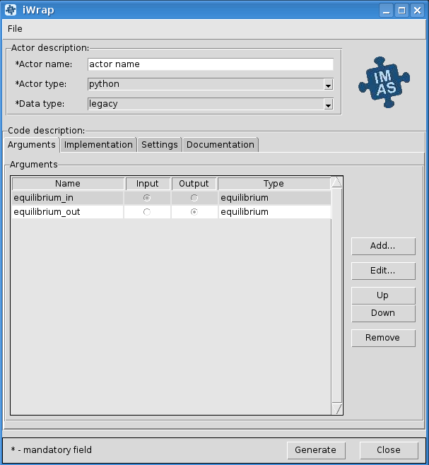
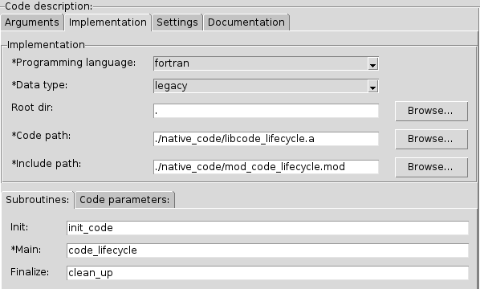
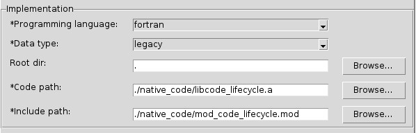
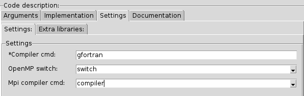
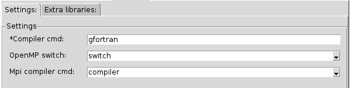
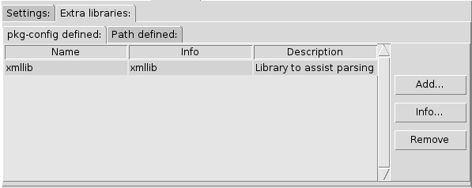
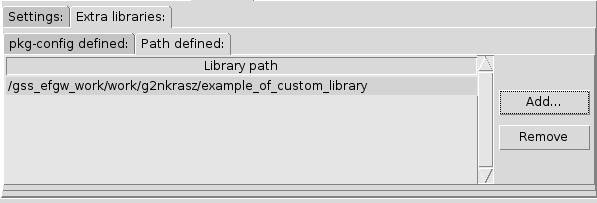

==================================================
Scientific Worfklows : iWrap - graphical interface
==================================================

.. toctree::
   :numbered:

.. note::
      **This tutorial explains:**

      -  iWrap graphic user interface
      -  How to set up actor description
      -  How to set up code description

.. note::
      All fields marked with \ **an
      asterisk**\ **('*')**\ are mandatory.

iWrap purpose
###############

**This section explains:**

-  iWrap generates a Fortran/CPP wrapper, which
   intermediates between Kepler actor and user code in terms
   of:

   -  reading/writing of in/out physical data (IDS)
   -  passing other arguments to/from the actor

-  iWrap creates a Python script (aka an actor) that:

   -  calls a user code
   -  provides error handling
   -  calls debugger (if run in "debug" mode)

iWrap main window
##################
|image1|

Actor description
##################
|image2|

This group of graphical controls allows setting the
description of the actor.

-  Actor name - a user-defined name of the actor
-  Actor type - a user-defined type of the actor
-  Data type -  an actor data type

Code description
#################

Arguments
===============
|image3|

In the table, there are columns like:

-  **Name** - user defined name of an argument
-  **Input/Output** - defines argument as \ *an
   input/output*
-  **Type** - defines an IDS based type of argument (e.g.
   equilibrium, topinfo, etc.)

On the right side of the table, there is a section with
buttons. Add button allows to add a new argument, edit to
edit argument and up/down buttons are changing the position
of selected argument in the table. The remove button removes
selected argument.

.. note::
      To change **Edit**, **Up**/**Down,** and **Remove**
      buttons state to active at least one argument has to
      be added to the table.

Add argument
---------------
|image4|

To add new arguments click **Add...** button in the
*Arguments* section. A new window named *iWrap - Add new
argument* will appear. Filling name (argument can be also
added with empty name) and selecting intent and type allow
adding new argument by clicking **Add** button. Click
**Cancel** to exit this window.

Edit argument
--------------
|image5|

There is also possible to edit arguments. When **Edit...**
button in the *Arguments* section is clicked, a new window
*iWrap - Edit argument* will appear. Change settings and
approve it by clicking **Close** button. To exit the window
click **Cancel**.

Implementation
===============
|image6|

Implementation
--------------------
|image7|

-  **Programming language** - a user code language
-  **Data** **type** - data type handled by the physics code
-  **Rood dir** - the root directory
-  **Code** **path** - path to system library (C, CPP),
   script (Python), etc, containing the physics code and
   method/subroutine to be run
-  **Include path** -  a module's / header's file path

Subroutines tab
"""""""""""""""

A user code should be provided as a subroutine.

|image8|

-  **Init** - a name of a subroutine that could be used to
   initialize the native code (optional)
-  **Main** - a name of the main subroutine that will be
   called from actor (mandatory)
-  **Finalize** - a name of a subroutine that could be used
   to finalize the native code (optional)

Code parameters tab
"""""""""""""""""""

*Code parameters*\ are all parameters that are specific to
the code (like switches, scaling parameters, and parameters
for built-in analytical models) as well as parameters to
explicitly overrule fields in the IMAS data structures.

|image9|

-  **Code parameters file** - XML file contains code
   parameters
-  **Schema file** - XSD file contains a schema

Settings
=========
|image10|

Settings
---------
|image11|

-  **Compiler cmd** - the compiler command used to compile
   native codes
-  **OpenMP switch** - theOpenMP switch
-  **MPI compiler cmd** - the MPI compiler command

Extra libraries
---------------
|image12|

pkg-config defined:
"""""""""""""""""""

pkg-configs defined are system libraries handled by the
pkg-config mechanism and required for building the user
code.

|image13|

In the table there is information about:

-  Name - a library name
-  Info - information about library
-  Description - a library description

pkg-config defined can be added and removed using buttons
placed on the right side of the table.

.. note::
      To change **Remove** button state to active at least
      one system library has to be added and selected.

Add pkg-config defined
^^^^^^^^^^^^^^^^^^^^^^^

To add new arguments click **Add...** button in the
*pkg-config defined*\ section. A new window named *Add
system library* will appear. The *search *\ field allows for
easy filtering of the list of libraries. To add a pkg-config
definedselect your choice and click **Ok** button. To close
the window click **Cancel**.

|image14|

Path defined
"""""""""""""""

*Path defined* are non-standard static libraries required
for building the user code.

|image15|

Available operations on libraries list:

-  **Add...** - Adds a new library to the list
-  **Remove** - Removes a new library from the list

.. note::
      To change **Remove** button state to active at least
      one library path has to be added and selected.

Documentation
==============

The\ *Documentation*\ tab specifies a user-defined actor
description.

|image16|

.. |image2| image:: attachments/70877876/77367784.png
   :class: confluence-embedded-image
   :width: 450px
.. |image3| image:: attachments/70877876/77367785.png
   :class: confluence-embedded-image
   :width: 450px
.. |image4| image:: attachments/70877876/77367789.png
   :class: confluence-embedded-image
   :width: 450px
.. |image5| image:: attachments/70877876/77367790.png
   :class: confluence-embedded-image
   :width: 450px

.. |image8| image:: attachments/70877876/77367796.png
   :class: confluence-embedded-image
   :width: 450px
.. |image9| image:: attachments/70877876/77367798.png
   :class: confluence-embedded-image
   :width: 450px

.. |image13| image:: attachments/70877876/77367810.png
   :class: confluence-embedded-image
   :width: 450px
.. |image14| image:: attachments/70877876/70878345.png
   :class: confluence-embedded-image
   :width: 500px

.. |image16| image:: attachments/70877876/77367832.png
   :class: confluence-embedded-image
   :width: 450px