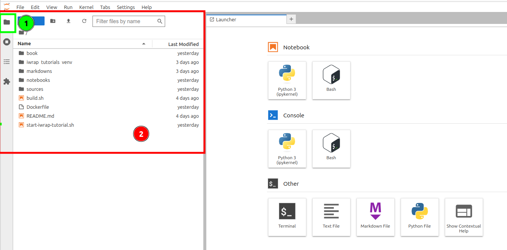
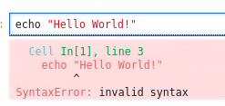

---
jupytext:
  text_representation:
    extension: .md
    format_name: myst
    format_version: 0.13
    jupytext_version: 1.16.0
kernelspec:
  display_name: Python 3 (ipykernel)
  language: python
  name: python3
---

# Notebooks Tutorial

These tutorials are available as Jupyter Notebook as well as more static html pages. We advised the Jupyter Notebooks 
for a more interactive experience. Below you will find some information to help you navigating through and using Jupyter Notebooks
with Jupyter Lab.


## File Browser

To easily switch between notebooks use **JupyterLab File Browser** on the left side of IDE.

```{admonition} Important
:class: attention

Currently, there is no other way of switching between notebooks.   
You need to click as shown below.  
```




JupyterLab offers build-in out of the box Interactive Table of Contents!  
You can find it on the **left sidebar**   


## Running Bash Code in Python Kernel using `code cells`

A Python kernel in Jupyter Notebook allows you to run Python and Bash shell commands and scripts interactively within notebook cells.   

```{admonition} Important!!
:class: attention

To run Bash code in Python kernel, **you need to preface the code with `!` character.**
```    

Example 1: Does **not** work



Example 2: Does work

```{code-cell}
!echo "Hello World!"
```


## Using Code Cells
To run a code cell in Jupyter Notebook, select the cell and press `Shift + Enter` or click the `Run` button in the toolbar.

The square brackets `[]` next to a code cell in a Jupyter Notebook indicate the **execution state**.
- **If empty** `[]` : the cell has not been run.
- **If filled with a number** `[n]` : the cell has been executed as the **nth** operation.
- **If there's an asterisk** `[*]`: the cell is currently running.

+++

```{admonition} The greatest feature of this tutorial
:class: attention

We can run ***Python GUI*** apps within this notebook!  
It is configured to run any python GUI written in `tkinter` module.  

```{admonition} iWrap GUI
:class: important

And because This is `iWrap` tutorial, you can run iWrap GUI in here! 
```

```{code-cell}
:tags: [skip-execution]

!iwrap-gui
```

```{admonition} C++  Fortran  Code
:class: important

This tutorial is configured to run codes written in `C++` and `Fortran`!  
Right now the only possible way is to use separate scripts that could be compiled and run from cell/terminal.
```

`````{tab-set}

````{tab-item} Fortran
```fortran
program HelloFortran
  implicit none
  write(*,*) 'Running Fortran in JupyterLab!'
end program HelloFortran

```
````

````{tab-item} C++
```cpp
#include <iostream>
using namespace std;
int main() {
    cout << "Running C++ in JupyterLab!" << endl;
    return 0;
}

```
````

`````

```{code-cell}
!g++ codes/hello_c++.cpp -o codes/hello_c++.exe && ./codes/hello_c++.exe
```

```{code-cell}
!gfortran codes/hello_fortran.f90 -o codes/hello_fortran.exe && ./codes/hello_fortran.exe
```

```{admonition} Integrated Terminal
:class: important

The last nice feature is integrated terminal with IMAS enviroment installed!!
To open terminal:
1. go to the top-left corner
2. click blue plus button
3. select terminal  
 and voila!

```


+++

```{admonition} TIP! You can use embedded terminal in JupyterLab
:class: tip

If you are using our docker based tutorial you can use every time you want it's embedded terminal
```

