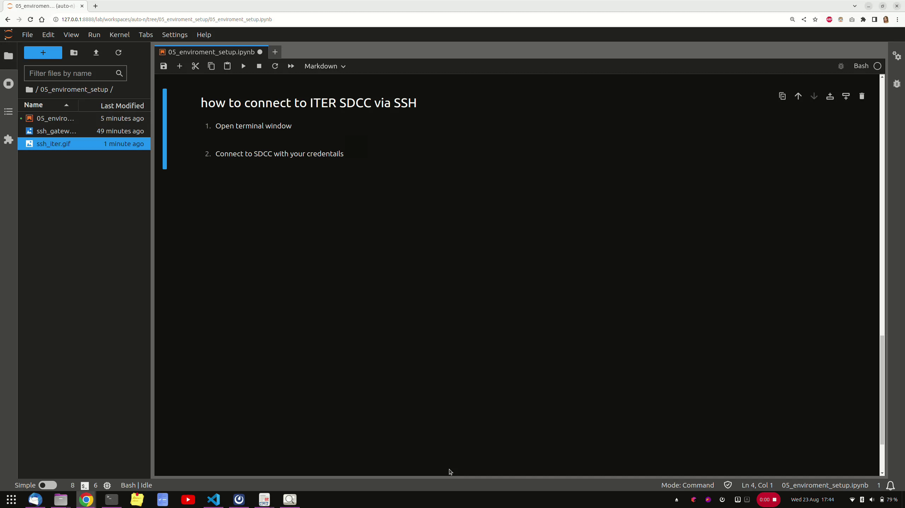

---
jupytext:
  text_representation:
    extension: .md
    format_name: myst
    format_version: 0.13
    jupytext_version: 1.16.0
kernelspec:
  display_name: Python 3 (ipykernel)
  language: python
  name: python3
---


# Connect to a system where IMAS and required dependencies are available

##  How to connect to ITER SDCC via SSH
1. Open terminal window
2. Connect to SDCC with your credentials
   

## How to connect to Gateway via SSH
1. Open terminal window
2. Connect to gateway with your credentials
   


# Environment Setup Check


+++

```{admonition} What you will do here
:class: note

In this section you will check if your tutorial environment is set up properly.

These scripts are designed to automatically change **username** to `system $USER`.
```


```{admonition} Check if you have **IMAS** installed 
:class: tip

To check if we can use IMAS run:
```

```{code-cell}
!echo $AL_VERSION
```


```{admonition} dblist 
:class: tip

To check if we have properly created our IDS we can use `dblist -u <username>` command:
```

```{code-cell}
!dblist -u $USER
```

```{admonition} idsprint
:class: tip

To list the content (all data) of an IDS,  use `idsprint`  script

Usage: `idsprint -u <URI>`

```

```{code-cell}
:tags: [output_scroll, hide-output]

!idsprint -u "imas:hdf5?user=$USER;pulse=1;run=1;database=tutorial_db;version=3#core_profiles"
```

```{admonition} Ready to go!
:class: hint

Now we have all environment set up and ready to go further with our tutorial!
```
