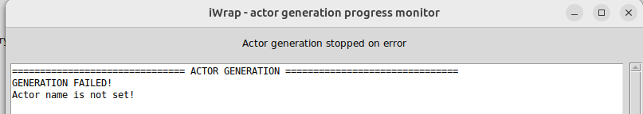

---
jupytext:
   text_representation:
      extension: .md
      format_name: myst
      format_version: 0.13
      jupytext_version: 1.16.0
kernelspec:
  display_name: Python 3 (ipykernel)
  language: python
  name: python3
---


# Actor and  code description

Please [refer to the docs](https://sharepoint.iter.org/departments/POP/CM/IMDesign/Code%20Documentation/IWRAP-doc/resources/project_description.html).

```{admonition} What will you learn in this section
:class: note
1. How to tell iWrap about your iWrapfied code
2. What is the structure of configuration file
3. What are the mandatory fields of this file
4. How to properly created this config manually and using iwrap GUI
5. How to generate Python actor with CLI and GUI
```

## How to tell iWrap about your **iWrap adapted** code

So iWrap needs a **configuration file** that holds information about your iWrap adapted methods.

This file is in **YAML** format.

It can be generated in two ways:
- **manually** by hand
- using **iWrap GUI** by filling proper information to boxes

```{admonition} Important! Fields are named the same in both ways!
:class: attention

So you can use the same configuration in `CLI` or `GUI`
```


## What does iWrap need to know from configuration file

1. **Details about the Actor**: This is an output created by iWrap. iWrap needs to know its name, where to save it, and more.
2. **Details about Your Code**: Things like the programming language, the information being passed in and out, and the type of that information.


## How does the configuration look?

Your configuration is split into two parts:
1. **Actor Description**: This is *optional*. It tells iWrap about the actor it's making.
2. **Code Description**: This is ***essential***. It tells iWrap about your code.

```{admonition} Caution!
:class: caution  

The following section details all the parameters and explains how to configure them in **either the GUI or directly in YAML file**.   
The examples provided below illustrate the *same settings being applied through these two different methods* for two codes, one in Fortran and one in C++.


```
## Actor description
The actor is what iWrap creates based on your code.

- `actor_name`: the arbitrary, **user defined** name of the actor.

  It determines e.g. : **the name of class to be generated and directory where actor will be put**. For example: `barometry_actor`.

    ```{admonition} Actor name is mandatory!
    :class: caution

    It is essential to specify the `actor_name` to initiate the construction of an actor accurately.   
    This can be done either through the YAML file or via the GUI interface,** but it is a mandatory requirement**.
  
    If you don't specify the `actor_name`, iWrap will throw an error durin actor creation and stop the generation process.  
  
    
    ```

    ```
- `actor_type`: right now we will focus on the simple type `python` (other types are available throught the use of plugins but this will be covered in advanced parts of the tutorial.
- `data_type`: data type handled at the workflow level. Right now, only the type `legacy` (i.e static IDS structures) type has been implemented.


`````{tab-set}

````{tab-item} GUI 


````


````{tab-item} YAML 

```yaml
actor_description:
    actor_name: actor1_fortran
    actor_type: python
    data_type: legacy
```
````

`````

```{admonition} Tooltips in GUI!
:class: hint

If you hover on GUI **text boxes** you will get help message of what is expected in this field! ;)


```


If you want to practice with the GUI, let's open it first:


```{code-cell}
:tags: [skip-execution]

!iwrap-gui
```

## Code description
This section tells iWrap about the program you've written.


````{admonition} GUI - Code description pane
:class: hint

This pane consists of sections (tabs):
- **Implementation** 
- **Settings** 
- **Subroutines** 
- **Code parameters** 
- **Documentation** 

   
````

### Implementation part

These are parameters used in **implementation** part:

- `implementation`:
    - `programming_language`: The language of your code, one of `Fortran` or `CPP`.
    - `data_dictionary_compliant`: The oldest version of Data Directory your actor can work with, e.g., `3.37.0`.
    - `subroutines`: The list of procedures your actor can perform.
        - `main`: The main task.
            - `name`: The subroutine actual name.  
            - `arguments`: List of methods arguments that your code needs or produces.

    - `code_path`: Where the main code file is located, e.g., `./iWrapped_codes/code1_fortran/libcode1.a`.
    - `include_path`: Where the header or module file is, like `./iWrapped_codes/code1_fortran/mod_code1.mod`.

         ```{admonition} Note
         :class: note
         
         Fortran doesn't care about uppercase or lowercase, **but the compiler does.**   
         Check the module name in the YAML matches the compiled one!
             
         ```

#### Arguments list

These are parameters used in this part:

- `arguments`: List of methods arguments that your code needs or produces.
    - `name`:  user defined argument name (`barometry00`)
    - `type`: a type of an predefined IDS (`barometry`)
    - `intent`: determines if given argument is input or output one (`IN`/`OUT`)

`````{admonition} GUI explanation: Click Me! 👈
:class: dropdown


```{admonition} Arguments tab
:class: hint 

The table contains the following columns:

- `Name`: A user-specified identifier for an argument.
- `Input/Output`: Classifies the argument as either input or output. {`IN`/`OUT`
- `Type`: Specifies the argument's IDS-based type, such as `equilibrium, barometry`, and so on.
```

````{admonition} Arguments control pane
:class: hint

Adjacent to the table on the right, there's a control panel featuring buttons:

- `Add`: Introduces a new argument to the table.
- `Edit`: Modifies the attributes of an existing argument.
- `Up/Down`: Adjusts the rank or position of a selected argument in the table.
- `Remove`: Deletes the chosen argument from the table.


```{admonition} Adding New Arguments
:class: note


1. Navigate to the **Arguments** section and click on the `Add…` button.
2. This action will open a window titled **iWrap - Add new argument**.
   - Provide a name for the argument. (Note: An empty name is acceptable.)
   - Choose the appropriate `intent` and `type`.
3. To finalize and add the new argument, press the `Add` button.
4. To exit without any changes, simply click the `Cancel` button.


```
```{admonition}  Editing Arguments
:class: note


1. To modify an argument, click the `Edit…` button located in the **Arguments** section.
2. The **iWrap - Edit argument** window will appear.
   - Adjust the settings as necessary.
3. Confirm and save your changes by pressing the `Close` button.
4. To exit without any changes, click the `Cancel` button.
```
````


```{admonition} Change button state to **active**
:class: attention  

To change `Edit, Up/Down,` and `Remove`` buttons state to **active** - at least *one argument has to be added to the table*.

```

`````
#### Subroutines

To define *MAIN* subroutine, one has to provide:

- the subroutine name (mandatory)
- the list of IDSe passed as IN/OUT arguments (mandatory)
- indication if code parameters have to be passed to subroutine (optional, default=false)

```{admonition} *INIT* and *FINALIZE* subroutines
:class: hint 

The same information must be provided to define *INIT* and *FINALIZE* subroutines,
but the purpose and usage of these methods will be explained in the next part of the tutorial

```


***Fortran example***

`````{tab-set}

````{tab-item} YAML 
```yaml
code_description:
    implementation:
        subroutines:
            main:
                name:     code1_step
                arguments:
                    - name: core_profiles_in
                      type: core_profiles
                      intent: IN
                    - name: distribution_sources_out
                      type: distribution_sources
                      intent: OUT

```

````

````{tab-item} GUI 
     


````

`````

***C++ example***


``````{tab-set}

````{tab-item} YAML 
```yaml
code_description:
    implementation:
        subroutines:
            main:
                name: code2_step
                arguments:
                    - name: distribution_sources_in
                      type: distribution_sources
                      intent: IN
                    - name: core_profiles_out
                      type: core_profiles
                      intent: OUT
```
````

````{tab-item} GUI 


````


``````

#### Other information

The other information that has to be provided to describe the code include (mentioned already above))

- `programming_language`: The language of your code, one of `Fortran` or `CPP`.
- `data_dictionary_compliant`: The oldest version of Data Directory your actor can work with, e.g., `3.37.0`.
- `subroutines`: The list of procedures your actor can perform.
- `code_path`: Where the main code file is located, e.g., `./iWrapped_codes/code1_fortran/libcode1.a`.
- `include_path`: Where the header or module file is, like `./iWrapped_codes/code1_fortran/mod_code1.mod`.

***Fortran Example***

`````{tab-set}

````{tab-item} YAML
```yaml
code_description:
    implementation:
        code_path:      ./iWrapped_codes/code1_fortran/libcode_fortran.a
        include_path:   ./iWrapped_codes/code1_fortran/mod_code1.mod
        programming_language: fortran
        data_dictionary_compliant: 3.37.0
        data_type: legacy
```

````
````{tab-item} GUI 

````

`````

***C++ Example***


```````{tab-set}


````{tab-item} YAML 
```yaml
code_description:
    implementation:
        code_path:      ./iWrapped_codes/code2_cpp/libcode_cpp.a
        include_path:   ./iWrapped_codes/code2_cpp/code2.h
        programming_language: cpp
        data_dictionary_compliant: 3.39.0
        data_type: legacy
```
````

``````{tab-item} GUI 

``````

```````


## Language-Specific Settings

Specific settings based on the programming language of  code.


- `Compiler cmd` - the compiler command used to compile  codes `gfortran/ g++`

```{admonition} GUI - Warning!
:class: warning
To enable `settings` tab you need to choose **programming language** on **implementation** tab firtst!


```


### Fortran Example

`````{tab-set}

````{tab-item} YAML 
```yaml
code_description:
    settings:
        compiler_cmd: gfortran
```

````

````{tab-item} GUI


````


`````

### C++ Example


`````{tab-set}


````{tab-item} YAML
```yaml
code_description:
    settings:
        compiler_cmd: g++
```
````

  


````{tab-item} GUI


````

`````


## Final YAML file


So the Final YAML files look like this:
```{admonition} Important!
:class: caution

The YAML content is the same whether it was implemented manually or the result of a saved settings by the GUI.
```


`````{tab-set}

````{tab-item} Fortran

```yaml
actor_description:
    actor_name: actor1_fortran
    actor_type: python
    data_type: legacy
code_description:
    implementation:
        subroutines:
            main:
                name:     code1_step
                arguments:
                    - name: core_profiles_in
                      type: core_profiles
                      intent: IN
                    - name: distribution_sources_out
                      type: distribution_sources
                      intent: OUT
        code_path:      ./iWrapped_codes/code1_fortran/libcode_fortran.a
        include_path:   ./iWrapped_codes/code1_fortran/mod_code1.mod
        programming_language: fortran
        data_dictionary_compliant: 3.39.0
        data_type: legacy
    settings:
        compiler_cmd: gfortran
```
````


````{tab-item} C++

```yaml
actor_description:
    actor_name: actor2_cpp
    actor_type: python
    data_type: legacy
code_description:
    implementation:
        subroutines:
            main:
                name: code2_step
                arguments:
                    - name: distribution_sources_in
                      type: distribution_sources
                      intent: IN
                    - name: core_profiles_out
                      type: core_profiles
                      intent: OUT
        code_path:      ./iWrapped_codes/code2_cpp/libcode_cpp.a
        include_path:   ./iWrapped_codes/code2_cpp/code2.h
        programming_language: cpp
        data_dictionary_compliant: 3.39.0
        data_type: legacy
    settings:
        compiler_cmd: g++
```
````
`````
## Actor Generation

### Using CLI


```{code-cell}
:tags: ["output_scroll", hide-output]

!iwrap -h
```


```{admonition} Hint!
:class: hint

You should see this line at the end of logs:

    -------------------- GENERATION COMPLETE! --------------------
    ALL DONE!
        
        

```


- **Fortran**

```{code-cell}
:tags: ["output_scroll", hide-output]

!iwrap --actor-type python --actor-name actor1_fortran --file codes/actor1_fortran.yaml
```

- **C++**

```{code-cell}
:tags: [output_scroll, hide-output]

!iwrap --actor-type python --actor-name actor2_cpp --file codes/actor2_cpp.yaml
```


### Using GUI

```{admonition} Actor Generation using GUI
:class: attention

To generate actor  with all of the mandatory fields filled you need to click th `Generate` button.  [1]  
New window with generation logs will pop up. [2]


```


```{admonition} Summary
:class: note  

**What we have done so far:**
- created YAML files that describes our  codes manually and using GUI!
- generated iWrap actors using CLI and GUI!

**What is next?**  
- We would use these actors in Python workflow script!
```
