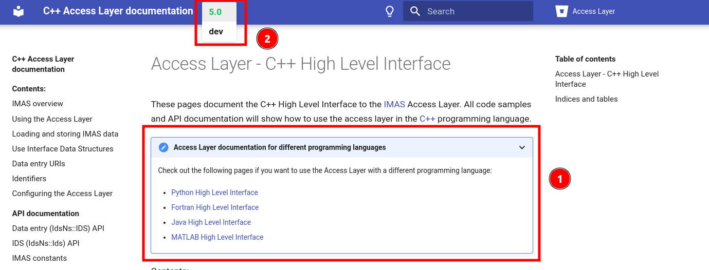

---
jupytext:
  text_representation:
    extension: .md
    format_name: myst
    format_version: 0.13
    jupytext_version: 1.16.0
kernelspec:
  display_name: Bash
  language: bash
  name: bash
---
# Introduction to Chapter 1

+++
```{admonition} Nice to see you!
:class: important

Welcome to this chapter, where we’ll cover the fundamentals of integrating  code with iWrap and constructing Python workflows.

```


```{admonition} Chapter Outline
:class: note

1. **Quick IMASification** tutorial.

2. **Basic  Code Standards:** We'll start by making the simplest  code that is compatible with iWrap, focusing on mandatory methods.

3. **YAML Descriptors:** Next, create YAML files to describe your  code to iWrap. *A GUI option is available!*

4. **iWrap Actors Generation using GUI:** Use GUI to generate iWrap actors based on your  code.

5. **iWrap Actors Generation using CLI:** Use YAML files to generate iWrap actors based on your  code.

6. **Python Workflows:**  Learn how to pass data between different iWrap actors.

By the end of this chapter, you’ll be well-equipped to integrate  code with iWrap and utilize Python for your workflow needs. Let's dive in!
``` 

```{admonition}  codes in this chapter.
Below is the repo layout of codes used in this chapter:
```

```{code-cell}
find . -type d -name 'codes' | xargs tree
```


## Preamble on adapting a code to IMAS

```{admonition} iWrap & IMAS & IDS relation
:class: note

iWrap creates _actors_ from codes that are adapted to IMAS, meaning that their signature shall make use of IDS data structures.
```

```{admonition} Code adaptation to IMAS is done **manually by developers**, not by iWrap
:class: attention 

iWrap does not adapt a code to use IMAS IDSs, this work has to be done manually by the code developers, as only them can 
translate accurately the code's internal data and data structures into IDSs.

```

```{admonition} How to adapt a physics code to IMAS docs
:class: note

More information on how to adapt a physics code to IMAS is available [here](https://confluence.iter.org/display/IMP/Getting+Started#GettingStarted-HowtoadaptaphysicscodetoIMAS).
```


```{admonition} Why do we need to adapt codes to IMAS step in an **iWrap** tutorial??
The reason is straightforward: **your code must be compatible with IMAS to be effectively used with the iWrap tool.**  
`iWrap` relies on certain `IMAS` implementation standards in its operations. Therefore, it's crucial for you to understand the significance of codes IMASification.   
Once you understand this, we will proceed to guide you through `iWrap` usage.
```

In case you don't have access to the aforementioned page, here is a quick example of how to adapt the source code and how to compile this adapted code.

These are our simple codes:

`````{tab-set}
````{tab-item} Fortran

```fortran
program code0

    implicit none
    character(:), allocatable :: greet_msg

    greet_msg = greet()

    write(*,*) "Message: ", greet_msg


contains
    function greet()
      character(:), allocatable :: greet

      allocate(character(5) :: greet)
      greet = 'Hello from pure Fortran'

    end function greet
  
end program code0

```
````

````{tab-item} CPP
```cpp
#include <iostream>
#include <string>
#include <memory>

std::unique_ptr<std::string> greeting()
{
    return std::unique_ptr<std::string>(new std::string("Good Morning from pure C++"));
}

int main(int argc, char* argv[])
{
    std::cout << *greeting() << std::endl;
}
```
````
`````

```{admonition} So to make above plain  codes **IMAS AL5 compatible**  (IMASified)
:class: tip

 we need to take below steps:
```

```{admonition} 1. get to know  [official IMAS AL5 HLI docs](https://sharepoint.iter.org/departments/POP/CM/IMDesign/Code%20Documentation/ACCESS-LAYER-doc/cpp/dev/using_al.html)  
:class: hint

   a. remember to change to desired supported language (`Python, java, fortran, matlab`)  
   b. change to **stable** version (`5.0`) instead of `dev`
     

```


```{admonition} 2. Change our codes to corresponding IMAS HLI:
:class: hint

Below is the very simple example of IMASified codes
```

`````{tab-set}
````{tab-item} Fortran
```fortran
program code0

    use ids_schemas, only: ids_distribution_sources
    use ids_routines

    implicit none

    type(ids_distribution_sources):: ids_out

    CALL getIDS(ids_out)

    write(*,*) "Message: ", ids_out%ids_properties%comment(1)


contains
    !===================================================================
    !                            MAIN
    !===================================================================
    function greet()
      character(:), allocatable :: greet

      allocate(character(5) :: greet)
      greet = 'Hello from Fortan IDS!'

    end function greet
  
    subroutine getIDS(ids_out)

        use ids_schemas, only: ids_distribution_sources
        use ids_routines

        implicit none

        type(ids_distribution_sources):: ids_out
        character(:), allocatable :: greet_msg

        greet_msg = greet()

        ids_out%ids_properties%homogeneous_time = IDS_TIME_MODE_HETEROGENEOUS ! Mandatory field

        if (.not. associated(ids_out%ids_properties%comment)) allocate(ids_out%ids_properties%comment(1))   
        ids_out%ids_properties%comment(1) = trim(greet_msg)

    end subroutine getIDS

end program code0

```
````

````{tab-item} CPP
```cpp
#include <iostream>
#include <string>
#include <memory>
#include "ALClasses.h"

std::unique_ptr<std::string> greeting()
{
    return std::unique_ptr<std::string>(new std::string("\nHello from C++ IDS!"));
}

/*
 * This is the process of IMASification in a nutshell.
 *
 */
IdsNs::IDS::distribution_sources greetingIDS()
{
    IdsNs::IDS::distribution_sources ids;

    ids.ids_properties.homogeneous_time = IDS_TIME_MODE_HETEROGENEOUS;  // Mandatory field
    auto greetingMsg = greeting();                                      // Use auto for convenience
    ids.ids_properties.comment = *greetingMsg;                          // Dereference the unique_ptr

    return ids;
}

int main(int argc, char* argv[])
{
    std::cout << greetingIDS().ids_properties.comment << std::endl;
}


```
````
`````

```{admonition} 3. Compile and Run our **IMASified** codes
:class: hint


Compile codes using intructions provided in [IMAS AL5 HLI docs](https://sharepoint.iter.org/departments/POP/CM/IMDesign/Code%20Documentation/ACCESS-LAYER-doc/fortran/5.0/using_al.html#using-the-access-layer-with-your-fortran-program): 
```


- **Fortran**

```{code-cell}
export FORTRAN_PATH="codes/imasification/imasified/code_fortran"
gfortran `pkg-config --libs --cflags al-fortran` $FORTRAN_PATH/imas_fortran_test.f90 -o $FORTRAN_PATH/imas_fortran_test.exe
./$FORTRAN_PATH/imas_fortran_test.exe
```


- **C++** using Makefile


```{admonition} This Makefile:
:class: dropdown

- Sets the `CPP_PATH` variable.
- Compiles `code0.cpp` with `C++11` standard, debugging symbols (-g), threading support (-pthread), and flags/libraries from pkg-config.
- Outputs the executable as `imas_cpp_test.exe`.
```

```{code-cell}
export CPP_PATH="codes/imasification/imasified/code_cpp"
make -C $CPP_PATH build executable
./$CPP_PATH/imas_cpp_test.exe
```


```{admonition} Bravo! What have you learned so far 
:class: tip


1. Why we need to make our codes `IMAS` **compatible** *first*, *before* **iWrapification**
2. How to make simple IMAS adaptation
3. How to compile IMAS adapted codes
```

```{admonition} What will you learn in the next lesson
:class: Note

1. How to change our IMAS adapted codes to be iWrap compatible!
2. What are iWrap implementaion standards rules
3. What other things we must do to prepare our codes to actor creation
```
