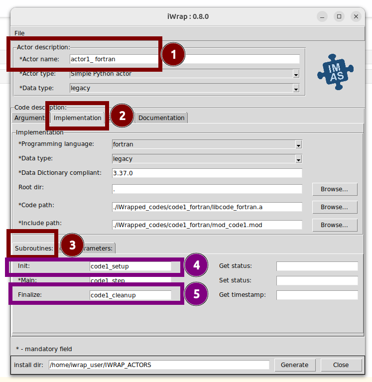
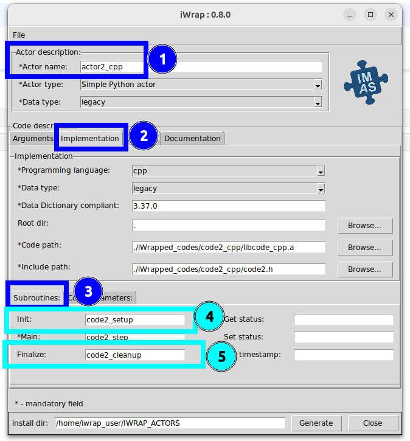
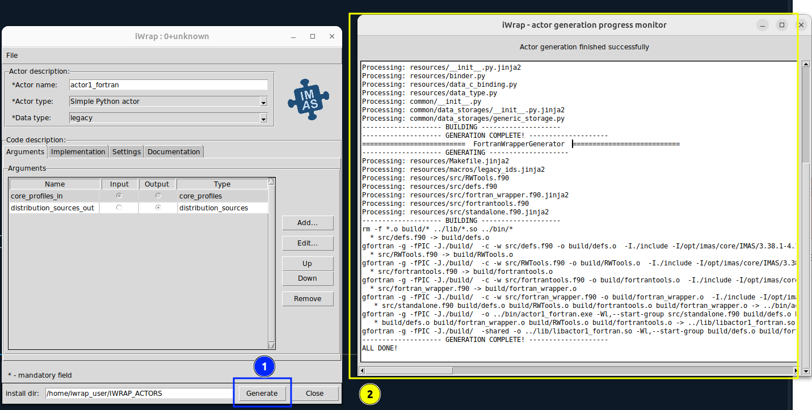

---
jupytext:
   text_representation:
      extension: .md
      format_name: myst
      format_version: 0.13
      jupytext_version: 1.16.0
kernelspec:
  display_name: Python 3 (ipykernel)
  language: python
  name: python3
---
# 1. Actor generation Part 2

````{admonition} What will you learn in this lesson:
:class: note

This lesson is divided into three parts:

```{admonition} 1. Adding new API functions in Code Description,
:class: tip

In this part of the lesson, you will focus on how to:

- Add additional methods to your YAML file, enhancing its functionality and scope.
- Configure iWrap GUI to include those new methods.
```


```{admonition} 2. Expanding CLI with a augmented Makefile
:class: tip

In the final section, we will build upon our previous work from `02__code_standardization`:

- Use an advanced Makefile located at `codes/Makefile` for a range of tasks:
- Compile the code using the previously discussed Makefile.  
- Create a Linux static library.  
- Generate iWrap actors based on the YAML file.  
- Execute the workflow.  
- Perform environment cleanup tasks.   
```
````


## 1.1. Adding new API functions in Code Description,

```{admonition} YAML
:class: attention


This YAML does not differ much from the previous one.   
We have only expanded the YAML file in the `subroutines` section by adding two fields corresponding to the additional methods we have just learned.
```
```{admonition} Tip! Path to YAML files
:class: tip

These files are already saved in this location: `codes/actor*.yaml`.  
They will be used in the next lesson.
```

```{admonition} Update GUI textboxes!
:class: hint

Remember to add proper methods names into GUI!
```


### 1.1.1. Fortran Example

If you want to practice with the GUI, let's open it first:


```{code-cell}
:tags: [skip-execution]

!iwrap-gui -f codes/actor1_fortran.yaml
```


::::{tab-set}

:::{tab-item} Fortran
```yaml
 
code_description:
    implementation:
        subroutines:
            init:       code1_setup    # ADDED !
            main:       code1_step
                arguments:
                -   name: core_profiles_in
                    type: core_profiles
                    intent: IN
                -   name: distribution_sources_out
                    type: distribution_sources
                    intent: OUT
            finalize:   code1_cleanup    # ADDED !
        code_path:      ./iWrapped_codes/code1_fortran/libcode_fortran.a
        include_path:   ./iWrapped_codes/code1_fortran/mod_code1.mod
        programming_language: fortran
        data_dictionary_compliant: 3.37.0
        data_type: legacy

    settings:
        compiler_cmd: gfortran

```
:::

:::{tab-item} GUI

:::

::::


### 1.1.2. C++ Example

```{code-cell}
:tags: [skip-execution]

!iwrap-gui -f codes/actor2_cpp.yaml
```

::::{tab-set}

:::{tab-item} C++

```yaml

code_description:
    implementation:
        subroutines:
            init:        code2_setup    # ADDED !
            main:        code2_step
                arguments:
                -   name: distribution_sources_out
                    type: distribution_sources
                    intent: IN
                -   name: core_profiles_in
                    type: core_profiles
                    intent: OUT
            finalize:    code2_cleanup    # ADDED !
        code_path:       ./iWrapped_codes/code2_cpp/libcode_cpp.a
        include_path:    ./iWrapped_codes/code2_cpp/code2.h
        programming_language: cpp
        data_dictionary_compliant: 3.37.0
        data_type: legacy
    settings:
        compiler_cmd: c++
```
:::

:::{tab-item} GUI

:::

::::


```{attention}
:class: attention

And then, just click **Generate** and you have everything set!


```


## 1.2. Expanding CLI with a Extended Makefile


This Makefile orchestrates the building process of two actors from wrapped `Fortran` and `C++` codes.   

```{code-cell}
!pygmentize codes/Makefile
```

Below is a step-by-step explanation of its contents:

### 1.2.1. Default Target: All

```makefile
all: actor_cplus actor_fortran
```

The default target all is responsible for building both actors, `actor1` and `actor2`.  
Running `make` **without any arguments will trigger this target**.


### 1.2.2. Compiling iWrapped code


```makefile
iWrapped_code_fortran:
	make -C iWrapped_codes/code1_fortran all

iWrapped_code_cplus:
	make -C iWrapped_codes/code2_cpp all

```

- `iWrapped_code_fortran`: Builds the Fortran code located in `iWrapped_codes/code1_fortran` with Makefile located in this folder.
- `iWrapped_code_cplus`: Builds the C++ code located in `iWrapped_codes/code2_cpp` with Makefile located in this folder.

### 1.2.3. Generating actors
```makefile
actor_cplus: iWrapped_code_fortran
	iwrap --actor-type python --actor-name actor_cplus_fortran --file actor_cplus_fortran.yaml

actor_fortran: iWrapped_code_cplus
	iwrap --actor-type python --actor-name actor_fortran_cpp --file actor_fortran_cpp.yaml

```
- `actor_cplus`: Generates a Python actor from the Fortran code.
- `actor_fortran`: Generates a Python actor from the C++ code.


### 1.2.4. Running the workflow

```makefile
wf-run:
	python workflow.py
```
The `wf-run` target executes the Python script `workflow.py`, which  runs the workflow involving the actors.

### 1.2.5. Cleaning up
```makefile
clean:
	rm -f *~
	make -C iWrapped_codes/code1_fortran clean
	make -C iWrapped_codes/code2_cpp clean

```

The `clean` target is used to remove temporary files and clean up build artifacts in the subdirectories.


###  1.2.6. How to run this makefile

```{admonition} Default option
:class: tip

Simply typing make with path to `codes`  will execute the default target, which in your case is `all`. This will build **both** `actor_cplus` and `actor_fortran`:

```

```{code-cell}
:tags: [output_scroll, hide-output]

!make -C codes
```

```{admonition} Execute specific target
:class: tip

If you want to build or execute a specific target, you can specify it after `make`.  
Please uncomment chosen commands
```

```{code-cell}
:tags: [skip-execution]

!make -C codes actor_cplus
```

```{admonition} Run workflow
:class: tip

To run the workflow, you would use:
```

```{code-cell}
:tags: [skip-execution]

!make -C codes wf-run
```

```{admonition} Clean up
:class: tip

If you want to clean up the build artifacts (like removing temporary files or cleaning up after a build), you can use the clean target:
```

```{code-cell}
:tags: [skip-execution]

!make -C codes clean
```


```{admonition} Summary
:class: note

**What we have done so far:**
In this lesson, we:

1. Enhanced the YAML file and GUI with new methods.
3. Employed an advanced Makefile at `codes/Makefile` for tasks including:
    - code compilation,
    - creating a Linux static library,
    - generating iWrap actors, 
    - executing the workflow, 
    - and environment cleanup.
```
