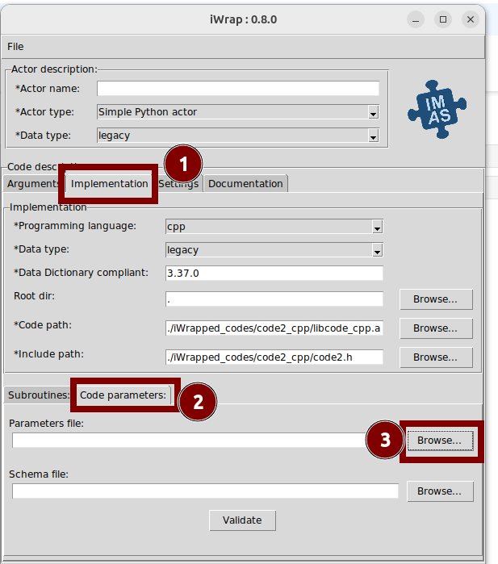
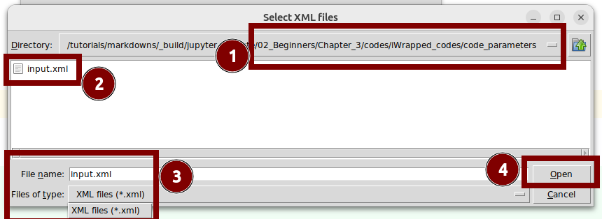
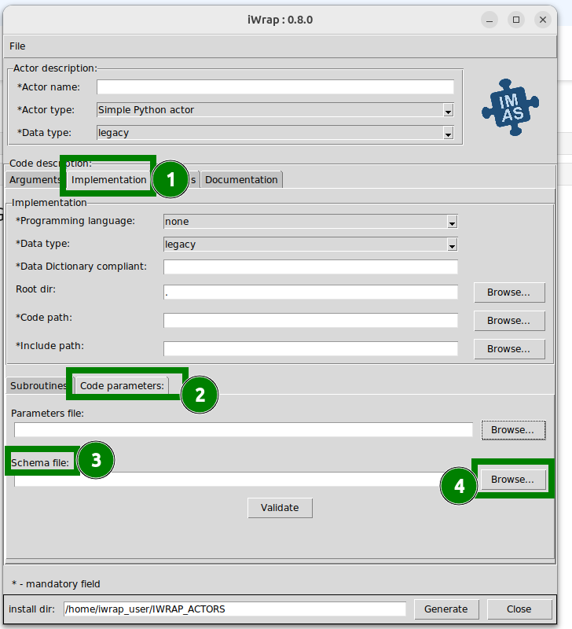
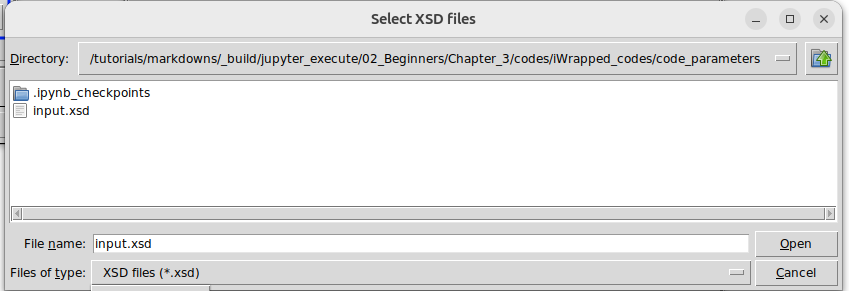
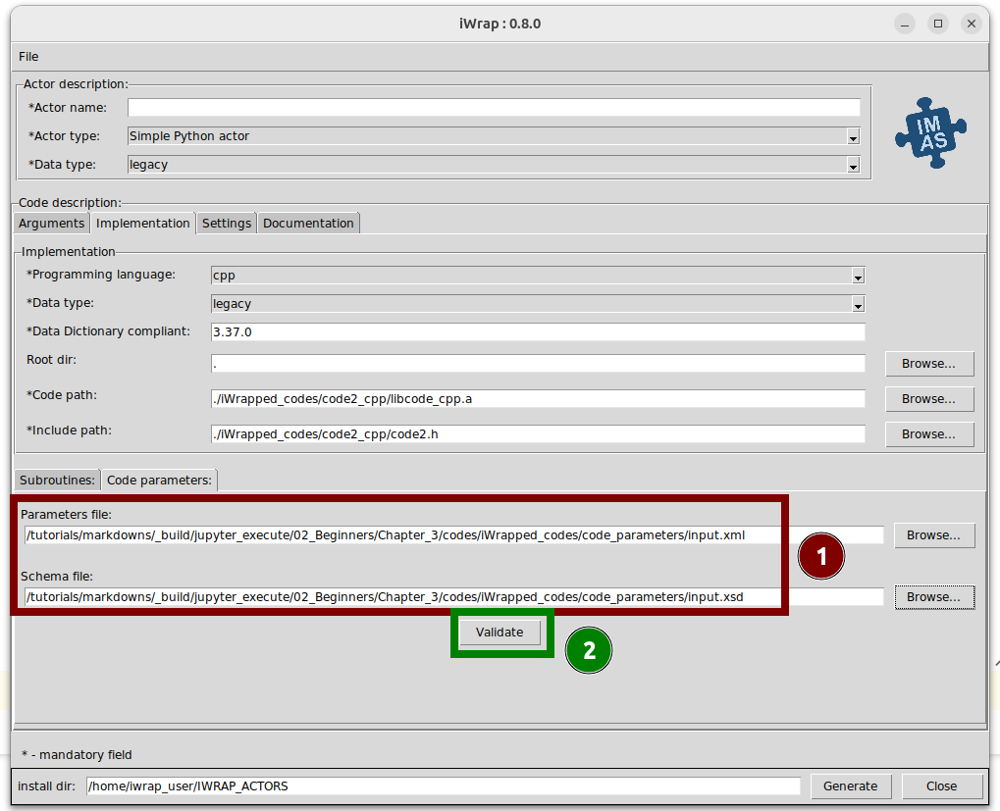
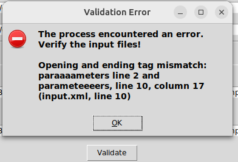
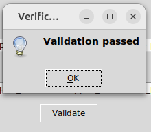
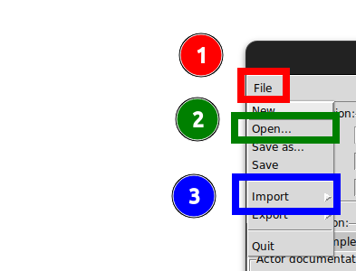

---
jupytext:
  text_representation:
    extension: .md
    format_name: myst
    format_version: 0.13
    jupytext_version: 1.16.0
kernelspec:
  display_name: Python 3 (ipykernel)
  language: python
  name: python3
---
# 1. Actor generation Part 3

```{admonition} What will you learn in this lesson
:class: note

1. How to expand YAML file to include configuration for code parameters
2. Methods for setting up **code parameters** via the GUI.
3. How to configure Makefiles to handle code parameters
```


## 1.1. Expanding YAML with Code Parameters

```{admonition} Attention
:class: attention

We have expanded the YAML file in the following sections:
- The `code_parameters` section now includes entries for the XSD and XML files explored earlier.
- In `settings.extra_libraries.pkg_config_defined`, the libraries `xmlib` and `libxml-2.0` have been added.

```


::::{tab-set}

:::{tab-item} Fortran
```yaml
code_description:
    implementation:
        subroutines:
            init:       code1_setup    
            main:       code1_step
                arguments:
                -   name: core_profiles_in
                    type: core_profiles
                    intent: IN
                -   name: distribution_sources_out
                    type: distribution_sources
                    intent: OUT
            finalize:   code1_cleanup   
        code_path:      ./iWrapped_codes/code1_fortran/libcode_fortran.a
        include_path:   ./iWrapped_codes/code1_fortran/mod_code1.mod
        programming_language: fortran
        data_dictionary_compliant: 3.37.0
        data_type: legacy
        code_parameters:
            parameters: ./code_parameters/input.xml   # ADDED
            schema:     ./code_parameters/input.xsd   # ADDED

    settings:
        compiler_cmd: gfortran
        extra_libraries:
            pkg_config_defined:
                - xmllib   # ADDED


```
:::

:::{tab-item} C++

```yaml
code_description:
    implementation:
        subroutines:
            init:       code2_setup    
            main:       code2_step
                arguments:
                -   name: distribution_sources_out
                    type: distribution_sources
                    intent: IN
                -   name: core_profiles_in
                    type: core_profiles
                    intent: OUT
            finalize:   code2_cleanup    
        code_path:      ./iWrapped_codes/code2_cpp/libcode_cpp.a
        include_path:   ./iWrapped_codes/code2_cpp/code2.h
        programming_language: cpp
        data_dictionary_compliant: 3.37.0
        data_type: legacy
        code_parameters:
            parameters: ./code_parameters/input.xml   # ADDED
            schema:     ./code_parameters/input.xsd   # ADDED
    settings:
        compiler_cmd: c++
        extra_libraries:
            pkg_config_defined:
                - libxml-2.0    # ADDED

```
:::


::::

## 1.2. Setting up code parameters via GUI

There are multiple methods available for configuring code parameters:

1. **Manual Configuration:** This can be accomplished directly within the GUI.

2. **Command-Line Argument:** Code Parameters can be set by providing a YAML file as an CLI argument to the `iwrap-gui` command.   

3. **YAML Import within GUI:** Import the YAML file after launching the GUI for dynamic configuration. 


### 1.2.1. Manual Configuration

1. Launch the GUI with this command:

```{code-cell}
:tags: [skip-execution]

!iwrap-gui
```


2. Navigate to the `Implementation` tab, then to `Code Parameters`
3. Set the paths to the XML and XSD files as follows:
`````{tab-set}

````{tab-item} XML

1. Click `Browse` next to `Parameters file`



2. Select proper path to XML file: `02_Basic/Chapter_3/codes/iWrapped_codes/code_parameters/input.xml`
3. Select desired file `input.xml`
3. Click `Open`



````

````{tab-item} XSD

1. Click `Browse` next to `Schema file`



2. Select proper path to XML file: `02_Basic/Chapter_3/codes/iWrapped_codes/code_parameters/input.xsd`
3. Select desired file `input.xsd`
3. Click `Open`



````

`````


After these steps, the text boxes should display the selected file paths.   




Use the `Validate` button   **[ 2 ]** to check if the `XML` and `XSD `files are correct.  
Depending on the validation results, you will receive appropriate feedback:
 
- if files are not valid you shoud see error message with hint what is wrong:

    

- if files are valid you should see such popup:

    

4. Once validated, click the Generate button to start process of actor generation.

### 1.2.2. Command-Line Argument

In this section we will set code parameters via command-line.

```{admonition} Caution!
:class: caution

This approach ensures that the **GUI initializes with the configurations specified in the YAML file**.
```


1. Review the iwrap-gui command options using `iwrap-gui -h`.
```{code-cell}
!iwrap-gui -h
```

2. Notice the `-f` flag, which allows specifying a YAML file:

```
  -f FILE, --file FILE  a path to code/actor description *.yaml file
```
3. Use the `-f` flag to load a YAML file:

- **Fortran**
```{code-cell}
:tags: [skip-execution]

!iwrap-gui -f codes/actor1_fortran.yaml  
```

- **C++**
```{code-cell}
:tags: [skip-execution]

!iwrap-gui -f codes/actor2_cpp.yaml  
```

```{admonition} Hint!
:class: hint

Verify that the code parameters are correctly set by checking under `Implementation tab -> Code Parameters`.     
If everything appears correctly, proceed by clicking `Generate`.
```


### 1.2.3. YAML Import within GUI

```{admonition} Caution!
:class: caution

    This allows for the dynamic configuration of parameters while the **GUI is already open.**
```

Let's load our YAML file from GUI

```{code-cell}
:tags: [skip-execution]

!iwrap-gui
```


To import YAML configuration into the iWrap GUI, please follow these steps:

1. In the upper left corner of the application, locate the `File` menu tab.
2. Expand this menu to reveal options such as `Open...` and `Import`.
3. Choose:
    - `Open` to load the **entire contents** of a YAML file,  
   or  
    - `Import` to load **only the code description section** of the YAML file.





```{admonition} Hint!
:class: hint

Check if code parameters are set correctly, by navigating to `Implematation tab` -> `Code Parameters`.  
If everything is set up properly - click `Generate` button.
```


## 1.3. Augmented Makefile with code parameters


The internal Makefiles have been updated as follows:
- The Makefile at `codes/iWrapped_codes/code1_fortran/Makefile` now includes `xmllib` in its `pkg-config` configuration.
  
```{code-cell}
!head -n 4 codes/iWrapped_codes/code1_fortran/Makefile
```

- The Makefile at `codes/iWrapped_codes/code2_cpp/Makefile` now includes `libxml-2.0` in its `pkg-config` configuration.

```{code-cell}
!head -n 4 codes/iWrapped_codes/code2_cpp/Makefile
```


Before running the Makefile, clean the environment:

```{code-cell}
:tags: [output_scroll, hide-output]

!make -C codes clean
```

Then, execute the Makefile with default options:

```{code-cell}
:tags: [output_scroll, hide-output]

!make -C codes
```

```{admonition} Summary
:class: note

**What we have done so far:**
- We have successfully created Python actors for Fortran and C++ codes.


**What is next?**  
- Utilizing these actors in a workflow.

```